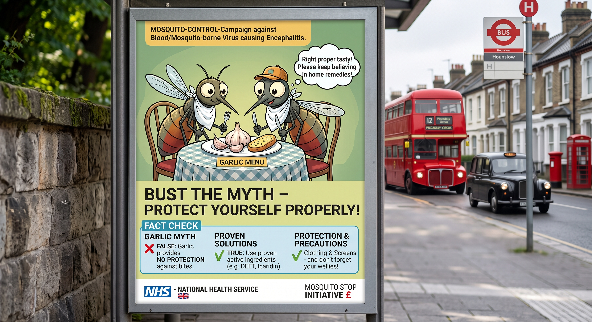

<figure data-align="right" style="--figure-width: 400px">

</figure>

One of the biggest information campaign during the [SEMViD-50 pandemic](semvid_50_pandemic) was the “Myths for Mosquitos”. First it was deployed by the british government but fast adapted internationally.

Public figures like athletes, musicians and actors informed about the biggest false information that claims to help against mosquitos.

## Garlic

The most common belief is that mosquitos smell the garlic and avoid areas with the intensive smell. But insects are not affected as humans are by the smell. But many people believed this because when they ate garlic and then were not stung by a mosquito estimated this an effective tool. Mosquitos adjust their targets by the amount of CO2 in the atmosphere. Therefore the most effective measure against mosquitos is a chemical spray like [Icaridin](https://en.wikipedia.org/wiki/Picaridin)

## Ultrasound waves

Another common belief is that phones can emit ultrasound waves that repell mosquitos. Many want to believe into a simple technical solution like downloading an app and be safe from mosquitos. But in reality ultrasound has no influence regarding the behaviour of stinging mosquitos.

## Reception of the Campaign

At large the campaign was successful especially on social media it was one of the campaign with the most views for a health campaign. In only weeks the slogans like “don’t feed the myth” many citizens were informed and changed beliefs regarding the handling with mosquitos.
