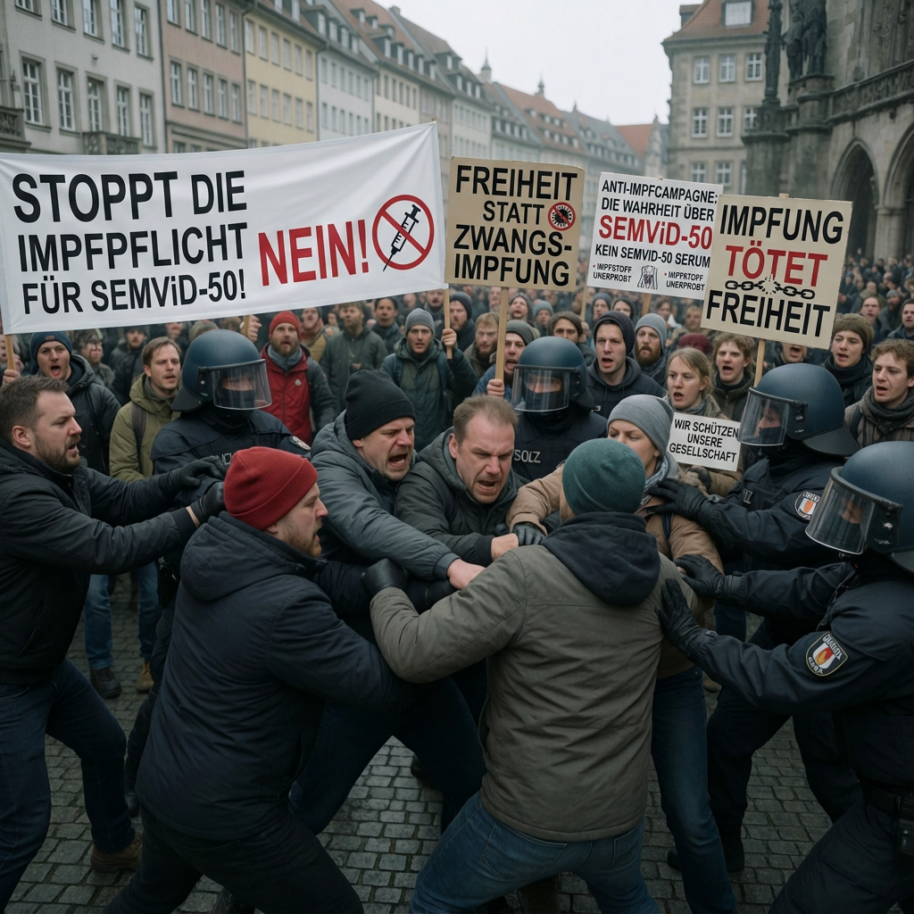

The [SEMViD-50 pandemic](semvid_50_pandemic) (also known as “Marmot Virus”) from 2050-2051 came along with severe impact on society and social interactions.

## Impact on Children and Education

As [SEMViD](semvid_virus) was initially suspected to also spread via [contact transmission](https://en.wikipedia.org/wiki/Transmission_%28medicine%29#Contact_transmission), special restrictions were established in schools and [day care](https://en.wikipedia.org/wiki/Child_care) facilities.

As a [precautionary measure](https://en.wikipedia.org/wiki/Precautionary_principle), strict [hygiene](https://en.wikipedia.org/wiki/Hygiene) protocols were implemented in schools at the beginning of the pandemic, including thorough [disinfection](https://en.wikipedia.org/wiki/Disinfection) after every visit to the toilet. Once the [modes of transmission](https://en.wikipedia.org/wiki/Transmission_%28medicine%29) had been identified, these measures were reduced to a normal level. Particular attention continued to be paid to hygiene when dealing with open [wounds](https://en.wikipedia.org/wiki/Wound) in schools. When injuries occured, school medical staff were informed to be extremly careful to not get in contact with blood or other wound liquids. Wearing [gloves](https://en.wikipedia.org/wiki/Medical_glove) and [masks](https://en.wikipedia.org/wiki/Surgical_mask) were mandatory to deal with any kind of treatment. Because of the restrictions, school operations were able to move on without starting [home schooling](https://en.wikipedia.org/wiki/Homeschooling) programs most of the time.

## Economic and social consequences

The resulting increase in the number of people requiring care placed considerable pressure on health and [social care](https://en.wikipedia.org/wiki/Social_care) systems. Hospitals initially faced shortages of [intensive-care beds](https://en.wikipedia.org/wiki/Intensive_care_unit), [neurological rehabilitation](https://en.wikipedia.org/wiki/Neurological_rehabilitation) facilities and specialised personnel. As the number of survivors with permanent [disabilities](https://en.wikipedia.org/wiki/Disability) increased, the demand shifted from acute medical treatment towards [long-term rehabilitation](https://en.wikipedia.org/wiki/Long-term_care), [home care](https://en.wikipedia.org/wiki/Home_care) and [institutional care](https://en.wikipedia.org/wiki/Institutional_care). Families frequently assumed part of the additional care burden, leading to reduced working hours and temporary or permanent withdrawal from employment among relatives.

The overall [economic impact](https://en.wikipedia.org/wiki/Economic_impact_of_the_COVID-19_pandemic) remained contained, with the [global economy](https://en.wikipedia.org/wiki/World_economy) declining only slightly despite initial disruptions among the working-age population. [Supply chains](https://en.wikipedia.org/wiki/Supply_chain) quickly stabilized as businesses adapted operational workflows, while [pharmaceutical](https://en.wikipedia.org/wiki/Pharmaceutical_industry) and [vector-control](https://en.wikipedia.org/wiki/Vector_control) firms recorded historic profits through surged demand for therapeutics, [vaccines](https://en.wikipedia.org/wiki/Vaccine), and containment measures.

At the same time, expenditure on healthcare, rehabilitation, [disability benefits](https://en.wikipedia.org/wiki/Disability_benefit) and long-term care increased substantially.

The long-term effects were more difficult to quantify because the number of people with permanent [neurological disabilities](https://en.wikipedia.org/wiki/Neurological_disorder) still remains uncertain.

### Division Within Society

The beginning of the SEMViD-50 pandemic led to increasing [social polarization](https://en.wikipedia.org/wiki/Social_polarization) within a relatively short period of time. [Social media](https://en.wikipedia.org/wiki/Social_media) and news coverage played a particularly important role in the development and reinforcement of different social positions. Although experts considered the social division to be less pronounced than, for example, during the [COVID-19 pandemic](https://en.wikipedia.org/wiki/COVID-19_pandemic), clearly recognizable social groups nevertheless emerged within a short period of time.

On one side, groups emerged that were critical of or opposed to reporting by [public-service media](https://en.wikipedia.org/wiki/Public_broadcasting). In their search for alternative sources of information, members of these groups increasingly encountered [conspiracy theories](https://en.wikipedia.org/wiki/Conspiracy_theory) and other claims that were not supported by [scientific evidence](https://en.wikipedia.org/wiki/Scientific_evidence). These narratives contributed in some cases to growing opposition to government measures intended to contain the spread of SEMViD. Social media played an important role in this process, as such content could spread rapidly and become reinforced within already established [echo chambers](https://en.wikipedia.org/wiki/Echo_chamber_%28media%29).

On the other side were individuals who, out of concern about infection with SEMViD, adapted their daily lives as much as possible to minimize the risk of infection. They frequently supported government protective measures and placed particular emphasis on avoiding situations associated with a high risk of infection. Differences in perceptions of the severity of the virus and the appropriate response to the pandemic further intensified the divisions between the various groups.

## Public Protest against SEMViD-50 Measures

<figure data-align="right" style="--figure-width: 300px">

</figure>

The polarization intensified significantly during the debate over a possible [vaccination mandate](https://en.wikipedia.org/wiki/Vaccination_policy#Mandatory_vaccination). Both sides increasingly perceived the opposing group as a threat to their own interests and, in some cases, to their personal safety. The disputes were not limited to political and social debate. In isolated cases, physical confrontations also occurred between opponents and [anti-vaccine activists](https://en.wikipedia.org/wiki/Vaccine_hesitancy) and supporters of vaccination.

One incident at an anti-vaccination demonstration in [Leipzig](https://en.wikipedia.org/wiki/Leipzig) attracted nationwide attention. Five individuals who denied the existence or severity of SEMViD-50 attacked a small group of counter-protesters. Three of those attacked were subsequently in critical condition and at times considered to be in life-threatening condition. All victims survived the attack.

Besides the anti-vax debates, a major public outcry occurred over the first [recall](https://en.wikipedia.org/wiki/Product_recall) of [blood transfusions](https://en.wikipedia.org/wiki/Blood_transfusion) and its tragic medical consequences. Especially during the first few weeks, the [Swiss medical system](https://en.wikipedia.org/wiki/Healthcare_in_Switzerland) could not replace any of the potentially infected infusions.

Despite these individual escalations, social conflicts remained comparatively limited overall. As the course of the pandemic gradually improved and public concern about SEMViD-50 declined, social tensions also began to subside. The social groups and divisions that had emerged during the pandemic consequently became less significant over time.
