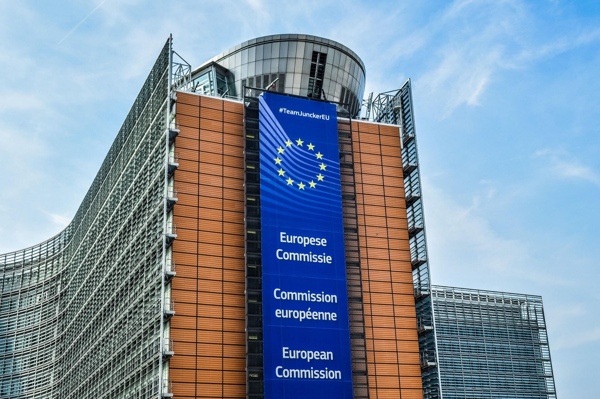

## Scientific collaboration

### Pathogen Access and Benefit Sharing

After a long time of negotiations the [PABS](https://www.thelancet.com/journals/lanmic/article/PIIS2666-5247(26)00031-5/fulltext)-annex was resolved but without important agreements regarding the benefit sharing. So the focus of the collaboration during [SEMViD-50 pandemic](semvid_50_pandemic) was the sharing of genome sequences via databases like [GenBank](https://en.wikipedia.org/wiki/GenBank) and Pathoplexus. The fast and easy access was crucial for all countries in order to start developing a [vaccine](semvid_50_vaccine) and react to new virus variants.

Nevertheless the scientific community lobbied for a new regulation and more international collaboration. There was also a movement of highly specialized scientists and engineers that built vaccine production fast. So the infrastructure to manufacture vaccines was deployed in many countries locally in order to reduce the risk of shutdown of [supply chains](https://en.wikipedia.org/wiki/Supply_chain). This was a very effective measure to have vaccines also in [low-income countries](https://en.wikipedia.org/wiki/Developing_country).

### Case Data and Privacy

In order to keep citizens informed, many countries deployed dashboards with case data and counts of infected people. These informations were also shared internationally so that scientists all over the world had access to the development of the pandemic. Also the typical [symptoms](semvid_disease) for each variant were shared worldwide so that new symptoms were recognized everywhere.

Due to [privacy concerns](https://en.wikipedia.org/wiki/Information_privacy), all data was [anonymized](https://en.wikipedia.org/wiki/De-identification) upfront. The only exceptions were local health government agencies so that people in the direct surroundings of infected people could be warned through [contact tracing](semvid_50_countermeasures).

## Political collaboration

### EU Collaboration

Following the classification of the [SEMViD-Virus](semvid_virus) as a [Public health emergency of international concern](https://en.wikipedia.org/wiki/Public_health_emergency_of_international_concern), an EU-specific emergency council was established to coordinate the European response to the pandemic. In view of the [European Single Market](https://en.wikipedia.org/wiki/European_single_market) and the existing legal framework governing the [free movement](https://en.wikipedia.org/wiki/Four_Freedoms_%28European_Union%29) of people and goods between member states, European governments agreed at an early stage to cooperate in the areas of medical research and the potential distribution of a vaccine.

<figure data-align="right" style="--figure-width: 400px">

</figure>

Due to the primary modes of transmission of SEMViD, which occurred through contact with blood and [mucous membranes](https://en.wikipedia.org/wiki/Mucous_membrane), the closure of internal [EU borders](https://en.wikipedia.org/wiki/Schengen_Area) was deemed unnecessary. Instead, the European response focused on limiting transmission through coordinated [public health measures](semvid_50_countermeasures) and joint research efforts.

#### Objectives

The initial objectives of the emergency council were:

- Containing the spread of SEMViD;
- Informing the public about the modes of transmission and symptoms of the disease;
- Supporting research into a vaccine; and
- Maintaining economic activity and [social cohesion](https://en.wikipedia.org/wiki/Social_cohesion).

To support these objectives, a special emergency fund of €200 billion was established. A substantial proportion of the fund was allocated to medical and scientific research, with the aim of rapidly expanding knowledge about SEMViD-50 and developing effective methods of preventing and treating the disease, particularly through [vaccination](semvid_50_vaccine).

#### European Vaccination Campaign

Following the initial availability of vaccines in December 2050, the [European Union](https://en.wikipedia.org/wiki/European_Union) coordinated a continent-wide vaccination campaign. The campaign was met with high levels of public acceptance and was considered successful. By October 2051, an estimated 87–88% of the European population had received a vaccination against SEMViD.

#### Dissolution

The EU emergency council remained active throughout the duration of the [PHEIC](https://en.wikipedia.org/wiki/Public_health_emergency_of_international_concern). Following the [termination of the Public Health Emergency of International Concern](end_of_the_semvid-50_public_health_emergency_speech) on 4 October 2051, the council was dissolved and its responsibilities were returned to the regular institutions and mechanisms of the European Union.

### Global Collaboration

The [WHO](https://en.wikipedia.org/wiki/World_Health_Organization), in cooperation with the Emergency Committee, coordinated the international response to the SEMViD-50 pandemic and served as a central body for the exchange of [epidemiological](https://en.wikipedia.org/wiki/Epidemiology) data. Following the WHO’s declaration of SEMViD-50 as a Public Health Emergency of International Concern, governments, research institutions and health authorities agreed to rapidly exchange research findings and establish international assistance programmes. The sharing of epidemiological databases enabled pharmaceutical companies and research institutions to conduct vaccine research simultaneously and independently.

Following the introduction of the first vaccine in December 2050, wealthier countries initially had greater access to available vaccine supplies. International funding programmes (such as [Gavi](https://en.wikipedia.org/wiki/Gavi%2C_the_Vaccine_Alliance)) were subsequently established to facilitate additional deliveries to countries with limited financial and medical resources. Particular emphasis was placed on prioritizing regions considered especially vulnerable to the effects of the pandemic.

By January 2051, more than 140 countries had joined the international vaccine distribution programme. The coordinated distribution effort contributed to a rapid increase in global [vaccination coverage](semvid_50_case_numbers_and_vaccination_data), which reached approximately 71% of the world’s population by October 2051.

The rapid and coordinated international response helped limit disparities in vaccine access and contributed to containing the global spread of SEMViD-50 within a comparatively short period of time. International cooperation was subsequently regarded as one of the key factors in the relatively successful management of the pandemic.
