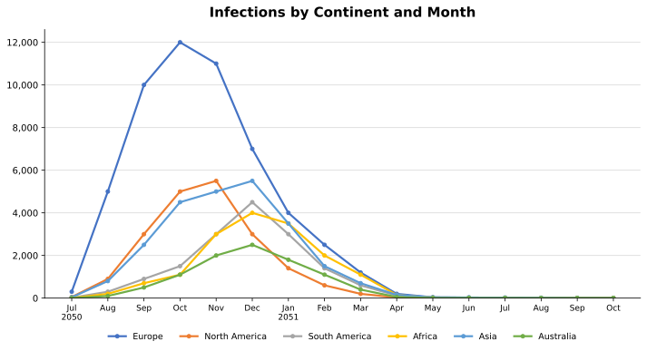
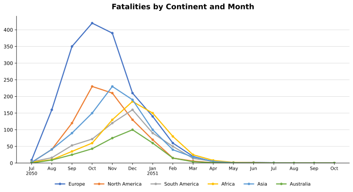
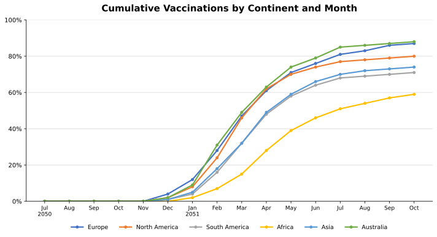

The following article depicts and analyzes the global numbers of [SEMViD-50](semvid_50_pandemic) infections, fatalities, and vaccinations as stated by the [WHO](https://www.who.int). While the data was expanded to include estimations of unreported cases and deceases, the WHO warns that it may still underestimate actual case numbers. Moreover, SEMViD-50 deaths may have been in part misclassified or not reported to healthcare authorities over the course of the [SEMViD-50 Pandemic](semvid_50_pandemic), mainly in underdeveloped regions.

Over the timespan of July 2050 to October 2051, the WHO estimates the total number of SEMViD-50 infections to encompass approximately 138,000 cases, of which ca. 5,100 were fatal. Europe remained the center of the pandemic throughout this time, accounting for about 40% of infections and 35% of demises. Moreover, Asia constituted 18%, North America 14%, South America and Africa 11% respectively, and Australia 7% of global infections.

International case numbers began to decrease in December 2050 as the northern hemisphere reached winter temperatures, which prevented mosquitos and migratory birds from further contributing to SEMViD-50’s expansion, and [pandemic countermeasures](semvid_50_countermeasures) unfolded their effect. Most importantly, the newly developed vaccine, [SEMVac](semvid_50_vaccine), became available to the public in the same month, and a rapidly increasing share of the population was vaccinated over the following months. As the following season of infections came into play in May, 56% of the world population had already been vaccinated. This number rose to 71% in October 2051.

## Estimated Infections

<figure data-align="center" style="--figure-width: 457px">

</figure>

This subchapter considers the number of total infections estimated by the WHO based on reported incidences as well as international approximations.

Although only 26 cases of SEMViD were initially identified in Switzerland, the pandemic nevertheless quickly spread across states and people, thereby reaching 300 cases in Europe in July. The same month, the virus reached all other continents, which is why the WHO declared a PHEIC. In subsequent months, infection numbers rose internationally to a peak of 30,000 in November. As the northern hemisphere, and especially Europe, entered the winter season, people spent less time outside and migratory birds and insect vectors became inactive, resulting in a reduction of case numbers in subsequent months in these regions. However, this relief did not apply to regions further in the south.

In December, the new SEMViD vaccination became available to the public with numbers of vaccinated individuals rising quickly. Therefore, as the pandemic entered into a new summer season in May, more than half of the world’s population was already immune. Infection numbers therefore continued to fall with cases dropping below 400 globally for the first time since the beginning of the pandemic. From June to October, less than 300 cases were reported worldwide. In the following, the WHO general-director therefore announced an end to the SEMViD-50 PHEIC state.

<table>
<thead>
<tr>
<th scope="col" rowspan="2" style="text-align: left">Region</th>
<th scope="colgroup" colspan="6">2050</th>
<th scope="colgroup" colspan="10">2051</th>
<th scope="col" rowspan="2">Total</th>
</tr>
<tr>
<th scope="col">Jul</th>
<th scope="col">Aug</th>
<th scope="col">Sep</th>
<th scope="col">Oct</th>
<th scope="col">Nov</th>
<th scope="col">Dec</th>
<th scope="col">Jan</th>
<th scope="col">Feb</th>
<th scope="col">Mar</th>
<th scope="col">Apr</th>
<th scope="col">May</th>
<th scope="col">Jun</th>
<th scope="col">Jul</th>
<th scope="col">Aug</th>
<th scope="col">Sep</th>
<th scope="col">Oct</th>
</tr>
</thead>
<tbody>
<tr>
<th scope="row" style="text-align: left">Europe</th>
<td style="text-align: right">300</td>
<td style="text-align: right">5,000</td>
<td style="text-align: right">10,000</td>
<td style="text-align: right">12,000</td>
<td style="text-align: right">11,000</td>
<td style="text-align: right">7,000</td>
<td style="text-align: right">4,000</td>
<td style="text-align: right">2,500</td>
<td style="text-align: right">1,200</td>
<td style="text-align: right">200</td>
<td style="text-align: right">40</td>
<td style="text-align: right">30</td>
<td style="text-align: right">18</td>
<td style="text-align: right">11</td>
<td style="text-align: right">5</td>
<td style="text-align: right">4</td>
<td style="text-align: right">53,308</td>
</tr>
<tr>
<th scope="row">North America</th>
<td style="text-align: right">50</td>
<td style="text-align: right">900</td>
<td style="text-align: right">3,000</td>
<td style="text-align: right">5,000</td>
<td style="text-align: right">5,500</td>
<td style="text-align: right">3,000</td>
<td style="text-align: right">1,400</td>
<td style="text-align: right">600</td>
<td style="text-align: right">200</td>
<td style="text-align: right">30</td>
<td style="text-align: right">12</td>
<td style="text-align: right">9</td>
<td style="text-align: right">6</td>
<td style="text-align: right">4</td>
<td style="text-align: right">5</td>
<td style="text-align: right">2</td>
<td style="text-align: right">19,718</td>
</tr>
<tr>
<th scope="row">South America</th>
<td style="text-align: right">20</td>
<td style="text-align: right">300</td>
<td style="text-align: right">900</td>
<td style="text-align: right">1,500</td>
<td style="text-align: right">3,000</td>
<td style="text-align: right">4,500</td>
<td style="text-align: right">3,000</td>
<td style="text-align: right">1,400</td>
<td style="text-align: right">600</td>
<td style="text-align: right">120</td>
<td style="text-align: right">35</td>
<td style="text-align: right">22</td>
<td style="text-align: right">15</td>
<td style="text-align: right">9</td>
<td style="text-align: right">7</td>
<td style="text-align: right">3</td>
<td style="text-align: right">15,431</td>
</tr>
<tr>
<th scope="row" style="text-align: left">Africa</th>
<td style="text-align: right">5</td>
<td style="text-align: right">200</td>
<td style="text-align: right">700</td>
<td style="text-align: right">1,100</td>
<td style="text-align: right">3,000</td>
<td style="text-align: right">4,000</td>
<td style="text-align: right">3,500</td>
<td style="text-align: right">2,000</td>
<td style="text-align: right">1,100</td>
<td style="text-align: right">150</td>
<td style="text-align: right">20</td>
<td style="text-align: right">14</td>
<td style="text-align: right">11</td>
<td style="text-align: right">7</td>
<td style="text-align: right">3</td>
<td style="text-align: right">2</td>
<td style="text-align: right">15,812</td>
</tr>
<tr>
<th scope="row" style="text-align: left">Asia</th>
<td style="text-align: right">40</td>
<td style="text-align: right">800</td>
<td style="text-align: right">2,500</td>
<td style="text-align: right">4,500</td>
<td style="text-align: right">5,000</td>
<td style="text-align: right">5,500</td>
<td style="text-align: right">3,500</td>
<td style="text-align: right">1,500</td>
<td style="text-align: right">700</td>
<td style="text-align: right">150</td>
<td style="text-align: right">30</td>
<td style="text-align: right">25</td>
<td style="text-align: right">21</td>
<td style="text-align: right">16</td>
<td style="text-align: right">7</td>
<td style="text-align: right">2</td>
<td style="text-align: right">24,291</td>
</tr>
<tr>
<th scope="row" style="text-align: left">Australia</th>
<td style="text-align: right">3</td>
<td style="text-align: right">100</td>
<td style="text-align: right">500</td>
<td style="text-align: right">1,100</td>
<td style="text-align: right">2,000</td>
<td style="text-align: right">2,500</td>
<td style="text-align: right">1,800</td>
<td style="text-align: right">1,100</td>
<td style="text-align: right">400</td>
<td style="text-align: right">50</td>
<td style="text-align: right">8</td>
<td style="text-align: right">7</td>
<td style="text-align: right">5</td>
<td style="text-align: right">3</td>
<td style="text-align: right">2</td>
<td style="text-align: right">2</td>
<td style="text-align: right">9,580</td>
</tr>
<tr>
<th scope="row" style="text-align: left"><strong>Total</strong></th>
<th style="text-align: right">418</th>
<th style="text-align: right">7,300</th>
<th style="text-align: right">17,600</th>
<th style="text-align: right">25,200</th>
<th style="text-align: right">29,500</th>
<th>26,500</th>
<th>17,200</th>
<th style="text-align: right">9,100</th>
<th style="text-align: right">4,200</th>
<th style="text-align: right">700</th>
<th>145</th>
<th>107</th>
<th style="text-align: right">76</th>
<th style="text-align: right">50</th>
<th>29</th>
<th>15</th>
<th>138,140</th>
</tr>
</tbody>
</table>

## Fatalities

<figure data-align="center" style="--figure-width: 457px">

</figure>

Of the 418 cases diagnosed in July 2050, 20 deceased, which implied an initial lethality of more than 5% of estimated infections. However, this large share of deaths can in part be explained with the disease being unknown at the time, and thereby hardly treatable. As the WHO announced the SEMViD-50 [PHEIC](https://en.wikipedia.org/wiki/Public_health_emergency_of_international_concern) and states began to take countermeasures against the virus, empirical lethality dropped to 4%, where it remained through until January, where 610 deaths occurred. Consequently, as infection numbers rose, deaths did so proportionately, which highlights that infections were, up to this point, hardly treatable.

As vaccinations took off in February 2051, global estimated lethality dropped to 2%, or 87 cases, in March 2051. For the timespan of June to October 2051, only 7 death cases took place globally. While lethality thus appeared to increase, this was only the case for a small sample of cases, which cannot be found statistically significant according to the WHO.

<table>
<thead>
<tr>
<th scope="col" rowspan="2" style="text-align: left">Region</th>
<th scope="colgroup" colspan="6">2050</th>
<th scope="colgroup" colspan="10">2051</th>
<th scope="col" rowspan="2">Total</th>
</tr>
<tr>
<th scope="col">Jul</th>
<th scope="col">Aug</th>
<th scope="col">Sep</th>
<th scope="col">Oct</th>
<th scope="col">Nov</th>
<th scope="col">Dec</th>
<th scope="col">Jan</th>
<th scope="col">Feb</th>
<th scope="col">Mar</th>
<th scope="col">Apr</th>
<th scope="col">May</th>
<th scope="col">Jun</th>
<th scope="col">Jul</th>
<th scope="col">Aug</th>
<th scope="col">Sep</th>
<th scope="col">Oct</th>
</tr>
</thead>
<tbody>
<tr>
<th scope="row" style="text-align: left">Europe</th>
<td style="text-align: right">9</td>
<td style="text-align: right">160</td>
<td style="text-align: right">350</td>
<td style="text-align: right">420</td>
<td style="text-align: right">390</td>
<td style="text-align: right">210</td>
<td style="text-align: right">140</td>
<td style="text-align: right">60</td>
<td style="text-align: right">20</td>
<td style="text-align: right">4</td>
<td style="text-align: right">1</td>
<td style="text-align: right">2</td>
<td style="text-align: right">1</td>
<td style="text-align: right">0</td>
<td style="text-align: right">0</td>
<td style="text-align: right">0</td>
<td style="text-align: right">1,767</td>
</tr>
<tr>
<th scope="row">North America</th>
<td style="text-align: right">2</td>
<td style="text-align: right">41</td>
<td style="text-align: right">120</td>
<td style="text-align: right">230</td>
<td style="text-align: right">210</td>
<td style="text-align: right">130</td>
<td style="text-align: right">70</td>
<td style="text-align: right">15</td>
<td style="text-align: right">6</td>
<td style="text-align: right">1</td>
<td style="text-align: right">1</td>
<td style="text-align: right">0</td>
<td style="text-align: right">0</td>
<td style="text-align: right">0</td>
<td style="text-align: right">0</td>
<td style="text-align: right">0</td>
<td style="text-align: right">826</td>
</tr>
<tr>
<th scope="row">South America</th>
<td style="text-align: right">4</td>
<td style="text-align: right">16</td>
<td style="text-align: right">53</td>
<td style="text-align: right">72</td>
<td style="text-align: right">120</td>
<td style="text-align: right">160</td>
<td style="text-align: right">90</td>
<td style="text-align: right">50</td>
<td style="text-align: right">14</td>
<td style="text-align: right">5</td>
<td style="text-align: right">2</td>
<td style="text-align: right">2</td>
<td style="text-align: right">1</td>
<td style="text-align: right">0</td>
<td style="text-align: right">0</td>
<td style="text-align: right">0</td>
<td style="text-align: right">589</td>
</tr>
<tr>
<th scope="row" style="text-align: left">Africa</th>
<td style="text-align: right">3</td>
<td style="text-align: right">10</td>
<td style="text-align: right">35</td>
<td style="text-align: right">60</td>
<td style="text-align: right">130</td>
<td style="text-align: right">185</td>
<td style="text-align: right">150</td>
<td style="text-align: right">80</td>
<td style="text-align: right">25</td>
<td style="text-align: right">8</td>
<td style="text-align: right">2</td>
<td style="text-align: right">1</td>
<td style="text-align: right">0</td>
<td style="text-align: right">0</td>
<td style="text-align: right">0</td>
<td style="text-align: right">0</td>
<td style="text-align: right">689</td>
</tr>
<tr>
<th scope="row" style="text-align: left">Asia</th>
<td style="text-align: right">2</td>
<td style="text-align: right">41</td>
<td style="text-align: right">90</td>
<td style="text-align: right">150</td>
<td style="text-align: right">230</td>
<td style="text-align: right">190</td>
<td style="text-align: right">100</td>
<td style="text-align: right">40</td>
<td style="text-align: right">18</td>
<td style="text-align: right">5</td>
<td style="text-align: right">1</td>
<td style="text-align: right">0</td>
<td style="text-align: right">0</td>
<td style="text-align: right">0</td>
<td style="text-align: right">0</td>
<td style="text-align: right">0</td>
<td style="text-align: right">867</td>
</tr>
<tr>
<th scope="row" style="text-align: left">Australia</th>
<td style="text-align: right">0</td>
<td style="text-align: right">9</td>
<td style="text-align: right">25</td>
<td style="text-align: right">43</td>
<td style="text-align: right">75</td>
<td style="text-align: right">100</td>
<td style="text-align: right">60</td>
<td style="text-align: right">15</td>
<td style="text-align: right">4</td>
<td style="text-align: right">1</td>
<td style="text-align: right">0</td>
<td style="text-align: right">0</td>
<td style="text-align: right">0</td>
<td style="text-align: right">0</td>
<td style="text-align: right">0</td>
<td style="text-align: right">0</td>
<td style="text-align: right">332</td>
</tr>
<tr>
<th scope="row" style="text-align: left"><strong>Total</strong></th>
<th style="text-align: right">20</th>
<th style="text-align: right">277</th>
<th style="text-align: right">673</th>
<th style="text-align: right">975</th>
<th style="text-align: right">1,155</th>
<th style="text-align: right">975</th>
<th style="text-align: right">610</th>
<th>260</th>
<th style="text-align: right">87</th>
<th>24</th>
<th style="text-align: right">7</th>
<th style="text-align: right">5</th>
<th style="text-align: right">2</th>
<th style="text-align: right">0</th>
<th style="text-align: right">0</th>
<th style="text-align: right">0</th>
<th style="text-align: right">5,070</th>
</tr>
</tbody>
</table>

## Vaccinations (Share of Population)

<figure data-align="left" style="--figure-width: 418px">

</figure>

After SEMViD vaccination was introduced to the public in December 2050, about 1% of the global population was vaccinated the same month. Due to better distribution infrastructure, and higher infection rates, higher vaccination rates of 4% and 2% respectively are found in Europe and North America. Over the following months, total vaccination rates quickly rose and entailed more than 50% of the world population by May 2051. Although vaccination efforts decelerated afterwards, according to the WHO because remaining individuals were hardly reachable or not interested in vaccination, the international share of vaccinated individuals nevertheless kept rising until the end of the official pandemic in October 2051.

<figure data-align="right" style="--figure-width: 457px">

</figure>

On the African continent, only 59% of population was vaccinated, which is the lowest share by continent in October 2051. Substantially higher values were reached by Asia, South America, and North America. The highest vaccinated shares of population are found in Europe and Australia, with 87% and 88% respectively, where high quality of healthcare and Europe’s great exposure to the pandemic facilitated capabilities and determination to quickly vaccinate.

<table>
<thead>
<tr>
<th scope="col" rowspan="2" style="text-align: left">Region</th>
<th scope="colgroup" colspan="6">2050</th>
<th scope="colgroup" colspan="10">2051</th>
</tr>
<tr>
<th scope="col">Jul</th>
<th scope="col">Aug</th>
<th scope="col">Sep</th>
<th scope="col">Oct</th>
<th scope="col">Nov</th>
<th scope="col">Dec</th>
<th scope="col">Jan</th>
<th scope="col">Feb</th>
<th scope="col">Mar</th>
<th scope="col">Apr</th>
<th scope="col">May</th>
<th scope="col">Jun</th>
<th scope="col">Jul</th>
<th scope="col">Aug</th>
<th scope="col">Sep</th>
<th scope="col">Oct</th>
</tr>
</thead>
<tbody>
<tr>
<th scope="row" style="text-align: left">Europe</th>
<td style="text-align: right">0%</td>
<td style="text-align: right">0%</td>
<td style="text-align: right">0%</td>
<td style="text-align: right">0%</td>
<td style="text-align: right">0%</td>
<td style="text-align: right">4%</td>
<td style="text-align: right">12%</td>
<td style="text-align: right">28%</td>
<td style="text-align: right">47%</td>
<td style="text-align: right">61%</td>
<td style="text-align: right">71%</td>
<td style="text-align: right">76%</td>
<td style="text-align: right">81%</td>
<td style="text-align: right">83%</td>
<td style="text-align: right">86%</td>
<td style="text-align: right">87%</td>
</tr>
<tr>
<th scope="row">North America</th>
<td style="text-align: right">0%</td>
<td style="text-align: right">0%</td>
<td style="text-align: right">0%</td>
<td style="text-align: right">0%</td>
<td style="text-align: right">0%</td>
<td style="text-align: right">2%</td>
<td style="text-align: right">8%</td>
<td style="text-align: right">24%</td>
<td style="text-align: right">46%</td>
<td style="text-align: right">62%</td>
<td style="text-align: right">70%</td>
<td style="text-align: right">74%</td>
<td style="text-align: right">77%</td>
<td style="text-align: right">78%</td>
<td style="text-align: right">79%</td>
<td style="text-align: right">80%</td>
</tr>
<tr>
<th scope="row">South America</th>
<td style="text-align: right">0%</td>
<td style="text-align: right">0%</td>
<td style="text-align: right">0%</td>
<td style="text-align: right">0%</td>
<td style="text-align: right">0%</td>
<td style="text-align: right">1%</td>
<td style="text-align: right">4%</td>
<td style="text-align: right">16%</td>
<td style="text-align: right">32%</td>
<td style="text-align: right">48%</td>
<td style="text-align: right">58%</td>
<td style="text-align: right">64%</td>
<td style="text-align: right">68%</td>
<td style="text-align: right">69%</td>
<td style="text-align: right">70%</td>
<td style="text-align: right">71%</td>
</tr>
<tr>
<th scope="row" style="text-align: left">Africa</th>
<td style="text-align: right">0%</td>
<td style="text-align: right">0%</td>
<td style="text-align: right">0%</td>
<td style="text-align: right">0%</td>
<td style="text-align: right">0%</td>
<td style="text-align: right">0%</td>
<td style="text-align: right">2%</td>
<td style="text-align: right">7%</td>
<td style="text-align: right">15%</td>
<td style="text-align: right">28%</td>
<td style="text-align: right">39%</td>
<td style="text-align: right">46%</td>
<td style="text-align: right">51%</td>
<td style="text-align: right">54%</td>
<td style="text-align: right">57%</td>
<td style="text-align: right">59%</td>
</tr>
<tr>
<th scope="row" style="text-align: left">Asia</th>
<td style="text-align: right">0%</td>
<td style="text-align: right">0%</td>
<td style="text-align: right">0%</td>
<td style="text-align: right">0%</td>
<td style="text-align: right">0%</td>
<td style="text-align: right">1%</td>
<td style="text-align: right">5%</td>
<td style="text-align: right">18%</td>
<td style="text-align: right">32%</td>
<td style="text-align: right">49%</td>
<td style="text-align: right">59%</td>
<td style="text-align: right">66%</td>
<td style="text-align: right">70%</td>
<td style="text-align: right">72%</td>
<td style="text-align: right">73%</td>
<td style="text-align: right">74%</td>
</tr>
<tr>
<th scope="row" style="text-align: left">Australia</th>
<td style="text-align: right">0%</td>
<td style="text-align: right">0%</td>
<td style="text-align: right">0%</td>
<td style="text-align: right">0%</td>
<td style="text-align: right">0%</td>
<td style="text-align: right">2%</td>
<td style="text-align: right">9%</td>
<td style="text-align: right">31%</td>
<td style="text-align: right">49%</td>
<td style="text-align: right">63%</td>
<td style="text-align: right">74%</td>
<td style="text-align: right">79%</td>
<td style="text-align: right">85%</td>
<td style="text-align: right">86%</td>
<td style="text-align: right">87%</td>
<td style="text-align: right">88%</td>
</tr>
</tbody>
</table>
