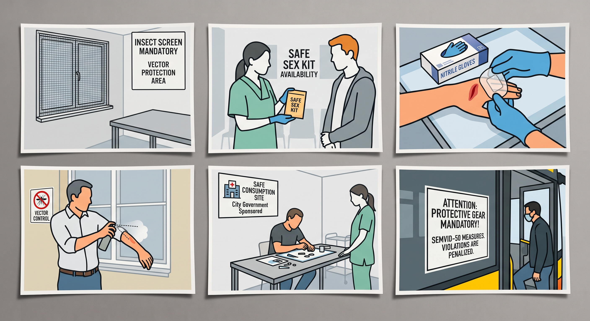
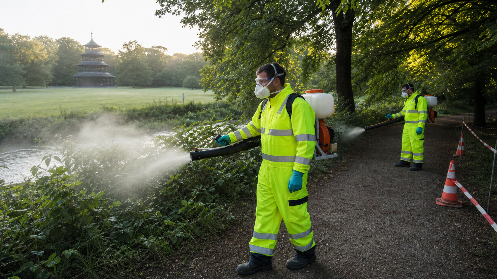

## Behavioral Measures in the SEMViD-50 Pandemic

### General and Diagnostic Measures

<figure data-align="right" style="--figure-width: 400px">

</figure>

Systematic diagnostic screening and rapid clinical intervention form the foundation of containment efforts during the [SEMViD-50](semvid_50_pandemic) pandemic. Regular testing is required for individuals presenting with known symptomatic markers, as well as for asymptomatic persons operating in high-exposure environments. Early detection drastically shortens the infectious window and prevents uncontrolled cluster formations. Individuals experiencing characteristic clinical signs must contact medical providers prior to physical presentation to ensure proper triage protocols are maintained. Strict home isolation must be observed immediately upon symptom onset or following a positive preliminary test, and may only be lifted following formal medical clearance.

### Prevention of Sexual Transmission

Direct mucosal and bodily fluid exchange during intimate contact represents a significant vector for human-to-human transmission. To mitigate this pathway, continuous risk-reduction practices are mandatory across all sexual interactions. This includes the consistent application of barrier methods, such as condoms and dental dams, which significantly decrease pathogen transfer rates.

Furthermore, effective containment relies on proactive communication and transparent contact tracing. Individuals who engage with multiple or frequently changing sexual partners are advised to establish a continuous testing schedule. In the event of a confirmed or suspected diagnosis, immediate notification of all recent contacts is required to allow for timely diagnostic evaluation, prophylactic measures, and the interruption of transmission networks.

### Wound Management and Personal Protective Equipment (PPE)

Exposure through non-intact skin and open wounds represents a high-risk route for viral entry. Heightened vigilance is required when managing injuries, bodily fluids, or potentially contaminated surfaces. All active abrasions, cuts, and lesions must be cleaned, disinfected, and sealed with medical-grade, waterproof coverings to prevent direct contact with external pathogens.

The standard deployment of [personal protective equipment](https://en.wikipedia.org/wiki/Personal_protective_equipment) (PPE) is critical in environments where physical exposure is possible. Single-use nitrile or latex gloves must be worn during first-aid administration, caretaking activities, and cleaning procedures. In clinical and high-risk operational settings, PPE protocols extend to fluid-resistant gowns, face shields, and protective eyewear to guard against splashes and direct fluid exposure.

### Vector Control (Mosquito-Borne Transmission)

Mitigating secondary transmission via mosquito vectors requires a combination of personal defense measures and broader environmental management. On an individual level, the application of chemical repellents containing tested active ingredients (such as [DEET](https://en.wikipedia.org/wiki/DEET), [Icaridin](https://en.wikipedia.org/wiki/Picaridin), or [IR3535](https://en.wikipedia.org/wiki/Ethyl_butylacetylaminopropionate)) provides necessary dermal protection. Wearing light-colored, long-sleeved clothing treated with insect-repelling agents further limits exposed skin surfaces during peak vector activity.

At the household and community level, structural barriers must be reinforced to prevent vector entry into living quarters. This involves installing and maintaining fine-mesh window screens, utilizing treated bed nets, and sealing structural gaps. Additionally, domestic breeding grounds must be systematically neutralized by eliminating standing water in containers, gutters, and outdoor collection units.

### Harm Reduction in Intravenous Drug Use

The intersection of infectious disease transmission and substance use requires evidence-based public health interventions that bypass social stigmatization. The sharing of injection equipment—including needles, syringes, filters, and preparation water—acts as a primary driver of blood-borne viral dissemination. Preventing this mode of transmission requires ensuring unimpeded access to sterile consumables through targeted exchange programs.

Specialized facilities for supervised drug consumption (Drogenkonsumräume) serve as critical infrastructure within the public health framework. Expanding the availability and operational capacities of these sites across all federal states enables sterile consumption under medical oversight, reduces environmental contamination, and provides access to diagnostic screenings. Integrating rapid testing and basic medical wound care directly within these spaces significantly lowers overall infection rates among vulnerable groups.

### Regulatory Framework and Compliance

To maintain structural integrity during the epidemic, standardized safety regulations and behavioral mandates are codified by law. Compliance with protective protocols—including mandatory PPE usage in defined public and commercial areas, quarantine orders, and reporting duties—is not discretionary.

Regulatory authorities are empowered to enforce these provisions through targeted inspections and administrative sanctions. Non-compliance, such as refusing mandatory testing under official orders, ignoring isolation directives, or failing to maintain required hygiene standards in public facilities, is subject to graduated fines and legal enforcement under infection protection statutes.

## Public information systems for the SEMViD-50 Pandemic

### semvid.info

In July of 2050 the [WHO](https://en.wikipedia.org/wiki/World_Health_Organization) declared the [PHEIC](https://en.wikipedia.org/wiki/Public_health_emergency_of_international_concern) to tackle the newly discovered Pathogen. Simultaneously a digital platform called “semvid.info” was developed to collect and distribute new information about the emerging pandemic. Quickly “semvid.info” developed into a public information platform, that got increasing usage from media, public officials and concerned citizens.

Realizing this, the WHO started to intensify its development in late August. In collaboration with almost all WHO member states and international alliances, new subdomains (eg. “semvid.info.de”, “semvid.info.eu”) were added to communicate locally relevant information about new measures and developments.

### WHO EARS

To counter the parallel “infodemic” of misinformation surrounding the SEMViD-50 outbreak, the WHO integrated its 5th Generation **EARS** (Early AI-supported Response with Social listening) platform into the project. Driven by artificial intelligence, the tool continuously monitors public, multi-language digital discourse to identify emerging health narratives, rising public anxieties, and critical “information voids”. Instead of waiting for false claims or harmful rumors to spread, EARS flags these communication gaps in real time. This automated social-listening intelligence allows the developers of *semvid-info* to quickly adapt their messaging, directly addressing public confusion and flooding digital networks with verified, evidence-based guidance before misinformation can gain traction.

The campaign [Myths for Mosquitos](british_campaign_against_semvid-50_myths_for_mosquitos) started in Britain became very popular and was also adopted by many otyths_for_mosquitosher countries. It is one of the best examples for successful communication.

## Symptom Screening During SEMViD-50

Symptom screening played a crucial role in combating the pandemic by ensuring that symptoms of SEMViD in all their forms—could be both recognized and observed.

### The Start of Symptom-Screening

Initially, various courses of the illness had to be observed in order to identify and attribute to the disease not only the primary symptoms that appeared first but also other, less common ones. Examining the frequency of the disease also aided in the analysis of symptoms. In the case of SEMViD, the identified symptoms resembled those of encephalitis—specifically fever, headaches, speech disorders, visual disturbances, and so on.

### Secondary Symptom-Screening

To effectively leverage awareness of the symptoms, it was necessary to identify the distinguishing features separating the condition from diseases with similar symptoms. Medical personnel were informed of these details as quickly as possible so they could take immediate action and implement precautionary measures upon encountering signs of SEMViD. To empower the public to assess their own health status, self-monitoring tools were developed; these allowed individuals to report their symptoms and receive an initial assessment regarding whether a doctor’s visit was advisable.

### Outcome

This development in symptom screening ensured that detailed knowledge regarding the disease’s symptoms reached the healthcare sector first, followed by the general population. This made it easier to assess the disease and potential infections, thereby facilitating rapid action.

## Tracking the spread

### Local early recognition and contact chains

After the initial outbreak the first known infected people were asked to share their recent contacts so that they could be warned. For example the 26 hikers who were [infected](https://en.wikipedia.org/wiki/Infection) notified other hikers that were in the same area. That was the attempt to contain the spread of the [virus](https://en.wikipedia.org/wiki/Virus) to a local outbreak.

In the next days and weeks it became clear, that other patients in the area were also infected with the [SEMViD](semvid_virus) virus. But after a short period the virus was widespread so that direct [infection chains](https://en.wikipedia.org/wiki/Contact_tracing) were almost impossible to monitor.

### Clinical and Syndromical Monitoring

Through the surveillance of cases in [Emergency Rooms](https://en.wikipedia.org/wiki/Emergency_department) and hospitals the SEMViD virus was fast known. Computer-based monitoring that recognized a steep increase in [encephalitis](https://en.wikipedia.org/wiki/Encephalitis) in [Switzerland](https://en.wikipedia.org/wiki/Switzerland). The local health government agency immediately acted and the patients were analysed and in the blood the new SEMViD virus was discovered.

After the insight of this new knowledge all patients with encephalitis symptoms were tested. Thanks to a fast development of a [PCR test](https://en.wikipedia.org/wiki/Polymerase_chain_reaction) this was possible. In a short period widespread monitoring of the virus and its symptoms was possible. Another important factor were the questionings of the patients to gather valuable information like transmission of the virus, symptoms.

The consequences of the virus also included complications regarding [blood](https://en.wikipedia.org/wiki/Blood_donation) and [tissue donations](https://en.wikipedia.org/wiki/Tissue_transplantation). The respective registers needed to check their donors in front of a donation and also were obliged to check the already available donations.

### Digital Contact-Tracing and monitoring of the vectors

Additionally to classic [contact tracing](https://en.wikipedia.org/wiki/Contact_tracing) where you directly share your data in [Germany](https://en.wikipedia.org/wiki/Germany) the app ["Gemeinsam-Sicher"](semvid_50_countermeasures#the_gemeinsam-sicher_app) (safe-together) was a way to track contacts, especially for intimate and sexual contacts.

Not only the contact tracing of infected humans but also the geographical monitoring of [vectors](https://en.wikipedia.org/wiki/Vector_%28epidemiology%29) like [mosquitoes](https://en.wikipedia.org/wiki/Mosquito) as an important factor in [pandemic prevention](https://en.wikipedia.org/wiki/Pandemic_prevention) in regard of spreading vectors enabled the identification of high-risk areas with higher population of vectors. Also the distinction of different species of mosquitoes increased the knowledge to avoid further infections.

### The Gemeinsam-Sicher App

The Gemeinsam-Sicher App was mainly set up to allow citizens to anonymously register intimate, or otherwise potentially infectious, contacts. This information was initially only stored at individual’s local devices to guarantee data privacy. As a person would register themselves as infected in the app, registered contacts could then be anonymously notified of an infection risk. Users could also name any further individuals not registered in the app which they had been in close contact with.

Moreover, Gemeinsam-Sicher included a database of articles and best practices on behaviour during SEMViD-50 to allow users to quickly inform themselves. Users were also asked to anonymously register any vaccinations or official test results, which could be analyzed to track the pandemic and its local reach.

### Personal Support Staff

At the same time as the Gemeinsam-Sicher App, the task-force also introduced a national organization of contact staff to personally support app users. Said personnel was available to users that had revealed themselves to be infected to consult them on their cure. Moreover, contact tracers were hired to identify and get in touch with any contacts named but not registered in the app.

### Criticism and Perception

While the scientific benefit of contact tracing was readily confirmed by leading epidemiologists, the app was not indulged by the German population, who considered the sharing of sexual contacts and other intimate data as inappropriate. Accordingly, studies show that even at the peak of infections, no more than 10% of the German population used the Gemeinsam-Sicher app.

## SEMViD Vector identification and control

The two vectors for the dissemination of SEMViD – ticks and mosquitoes – were discovered early on in the pandemic. Subsequent efforts have been made by governments and private firms to control or eradicate this source of infestation.

### Ticks

Ticks were the initial Vector through wich the first 26 cases in Switzerland of infestation occurred. After becoming aware of this Vector regional warnings were issued. In the following days infected ticks were next discovered in Norway and later in another 5 non-european countries. As a result on the 22nd of July the WHO issued a global warning and recommended the decontamination of outdoor equipment when traveling.

### Mosquitoes

<figure data-align="right" style="--figure-width: 200px">

</figure>

On the 30th of July a Swiss laboratory discovered Mosquitoes as a second vector caused by a mutation of the virus. After the announcement a rush to buy all available mosquito repellent and other anti mosquito supplies lead to the intervention of the German government to control the access. About two weeks later efforts were made to protect highly populated areas by sending out teams to spray wide areas with insecticides. Later this was also achieved with the use of automated drones. Concerns in the population about harm to both the environment and health lead to Protests, most notable in Munich because of dying plants in the English Garden. Government subsidies lead to quick advances in producing more sustainable insecticides, that first reached the marked on the 1st of October 2050. To increase awareness about the vectors, the [myth-for-mosquitos](british_campaign_against_semvid-50_myths_for_mosquitos) campaign was initiated.

#### Engineered Mosquitoes

In the end of July 2050 it was found out that mosquitoes had become a second vector as a result of viral mutations - especially dangerous was the Korean bush mosquito (Aedes koreicus) contributed particularly strongly to the spread of the virus, but there are also cases in which transmission by common house mosquitoes cannot be ruled out. Immediately after the discovery research into genetically modified mosquitoes was initiated. These mosquitoes wouldn’t be able to carry the disease thus eliminating the vector by spreading the genomes in the population. This measure is so effective because of the gene drive technology that ensures that mosquitoes with modified genetic material pass it on with significantly higher probabilities when reproducing with unmodified specimens. In this way, the trait that is central to combating the virus can rapidly spread throughout the population within just a few generations. The effort was heavily subsidized by the European Union under the conditions that information would be shared between the companies within the program. On the 22nd of November the first prototype was tested in Burkina Faso. The local government agreed to take the risk in exchange for investments into similar research for different diseases carried by mosquitoes. Finally on the 9th of April, when it was warm enough to assume that the mosquitoes would have a sufficiently high reproduction rates, 46 Million genetically modified mosquitoes were released from 30 different locations across Germany being a global forerunner. Countries all around the world followed. Such drastic measures were needed, since the mosquitoes were surviving the winter, due to it being the warmest since records began.

### Birds as reservoirs

It is now well known that birds act as a reservoir for SEMViD. The first affected species were golden eagles however the virus has spread to several more urban species as of 2052 such as doves, blackbird and sparrows. In order to control the reservoir, a regular screening of birds is initiated by RKI. As scientists acknowledged that restricting mosquito populations is easier than avian population control, most efford is put into vector control.

## Testing Measures

main article: [Tests for semvid-50](tests_for_semvid-50)

Following the development of a PCR test for SEMViD, most governments implemented strict testing protocols for different sectors. In most countries, medical staff was required to test daily, while people entering the country had to present proof of a negative PCR test that was at most a week old. As many other EU countries, Germany initially banned any commercial sex work, following the rise of the gamma variant. However, this ban was quickly lifted again and workers were required to test daily instead.

As at-home tests became available, the WHO issued a comprehensive set of test recommendations. While they generally recommended weekly testing, they specified that people should administer an at-home test in the following situations:

- Suspicion of symptoms
- After spending prolonged time in nature
- Contact with infected people
- Before making use of commercial sex work.
