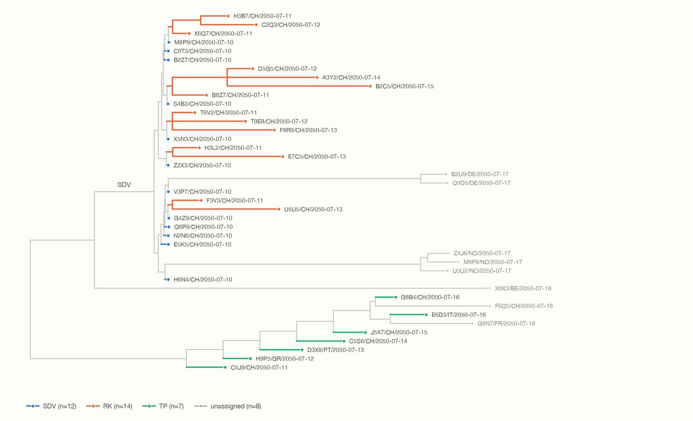
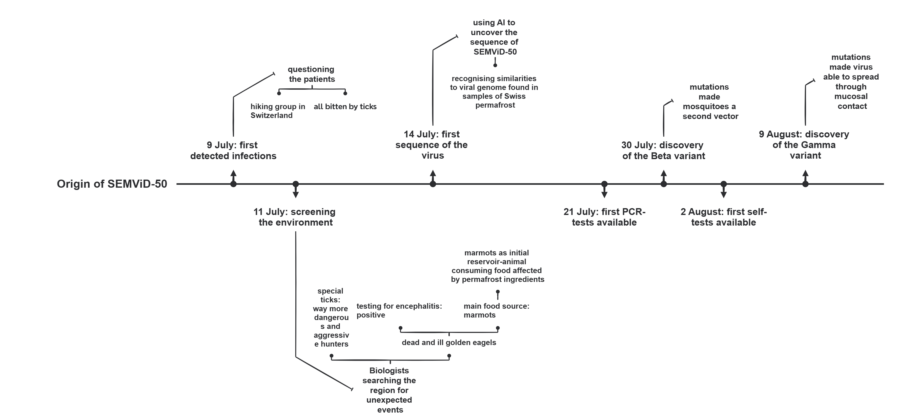

The global SEMViD-50 pandemic (also known as the “Marmot” pandemic), caused by SEMViD-Virus, began with an outbreak in Bella Tola, [Switzerland](https://en.wikipedia.org/wiki/Switzerland), in June 2050. It spread to other parts of [Europe](https://en.wikipedia.org/wiki/Europe) and then worldwide in the summer of 2050. The [World Health Organization](https://en.wikipedia.org/wiki/World_Health_Organization) (WHO) declared the outbreak a [Public health emergency of international concern](https://en.wikipedia.org/wiki/Public_health_emergency_of_international_concern) (PHEIC) on 21st July 2050. The WHO declared that the public health emergency caused by SEMViD-50 had ended in October 2051, while noting that SEMViD continued to be a global health threat.

<table>
<thead>
<tr>
<th scope="colgroup" colspan="3">SEMViD-50 Pandemic — Topic Overview</th>
</tr>
</thead>
<tbody>
<tr>
<td><strong>Main Articles</strong></td>
<td><a href="timeline">Home</a> • <a href="semvid_50_pandemic">SEMViD-50 Pandemic</a> •</td>
</tr>
<tr>
<td><strong>Virology &amp; Clinical</strong></td>
<td><a href="semvid_virus">SEMViD Virus</a> • <a href="semvid_disease">SEMViD Disease</a> • <a href="semvid_relative">Related Strains</a> • <a href="tests_for_semvid-50">SEMViD-50 tests</a></td>
</tr>
<tr>
<td><strong>Countermeasures &amp; Medical</strong></td>
<td><a href="semvid_50_countermeasures">Countermeasures</a> • <a href="semvid_50_vaccine">SEMViD-50 Vaccine</a> • <a href="semvid_50_case_numbers_and_vaccination_data">Case Numbers &amp; Vaccination Data</a></td>
</tr>
<tr>
<td><strong>Global Context &amp; Reports</strong></td>
<td><a href="international_collaboration_during_semvid-50_pandemic">International Collaboration</a> • <a href="un_report_climate_factors_favouring_semvid-50_pandemic">UN Climate Factors Report</a> • <a href="who_pandemic_readiness_report_2050">WHO Pandemic Readiness Report 2050</a> • <a href="end_of_the_semvid-50_public_health_emergency_speech">End of PHEIC Speech</a></td>
</tr>
<tr>
<td><strong>Societal &amp; Psychological Impact</strong></td>
<td><a href="impact_on_society_during_the_semvid-50_pandemic">Impact on Society</a> • <a href="impact_on_mental_health_during_semvid-50">Impact on Mental Health</a> • <a href="protests_leading_to_the_end_of_the_semvid-50_pandemic">Protests &amp; Easing of Measures</a></td>
</tr>
<tr>
<td><strong>Communication &amp; Discourse</strong></td>
<td><a href="british_campaign_against_semvid-50_myths_for_mosquitos">Myths for Mosquitos Campaign</a> • <a href="conspiracy_theories_during_semvid-50">Conspiracy Theories</a> • <a href="semvid_50_laboratory_theory">Laboratory Theory</a></td>
</tr>
</tbody>
</table>

## Outbreak

<figure data-align="right" style="--figure-width: 300px">

</figure>

[Epidemiological tracing](https://en.wikipedia.org/wiki/Contact_tracing#Epidemiological_tracing) has identified the [index cases](https://en.wikipedia.org/wiki/Index_case) among a group of 52 young adults affiliated with the [Studienstiftung des deutschen Volkes](https://en.wikipedia.org/wiki/Studienstiftung) (German Academic Scholarship Foundation). The group summited the Bella Tola, a summit in the Valais Alps, on 28 June 2050. During this excursion, at least 12 individuals were bitten by infected [ticks](https://en.wikipedia.org/wiki/Tick). Following a lively discussion on the importance of blood donations, a group of those students decided to donate blood shortly after on 2th July. Among those, there were 6 infected. In total, 14 recipients of blood donations got infected via blood conserves on the same day, forming the RK (Rotes Kreuz) cluster of infections. Severe illnesses amongst both of these groups in the following weeks, including the death of two, prompted a coordinated investigation by the [Federal Office of Public Health](https://en.wikipedia.org/wiki/Federal_Office_of_Public_Health) (FOPH) and the [Robert Koch Institute](https://en.wikipedia.org/wiki/Robert_Koch_Institute). Through questioning of patients, it was quickly identified that all of the initial cases had been bitten by ticks while hiking. A closer inspection of the ticks that had been collected from the patients, allowed the creation of a list of possible [reservoirs](https://en.wikipedia.org/wiki/Natural_reservoir) for a corresponding disease, reflecting DNA present in the ticks and native prey. The potential origin of the virus could be further specified following [sequencing](https://en.wikipedia.org/wiki/DNA_sequencing) of the virus and a comparison with samples of [permafrost](https://en.wikipedia.org/wiki/Permafrost), revealing that similar genetic material was present in the thawing Rechy [rock glacier](https://en.wikipedia.org/wiki/Rock_glacier) in the [canton of Valais](https://en.wikipedia.org/wiki/Canton_of_Valais). While the first known cases consisted only of young adults, it soon showed that the virus can also infect people of other demographics.

<figure style="--figure-width: 736px">

</figure>

Extensive investigations by a group of researchers across Europe led to traces found in [alpine marmots](https://en.wikipedia.org/wiki/Alpine_marmot), [alpine ibexes](https://en.wikipedia.org/wiki/Alpine_ibex), and [golden eagles](https://en.wikipedia.org/wiki/Golden_eagle). While ibexes and marmots seemed unaffected, several dead golden eagles were identified as likely victims of the disease. [Mutations](https://en.wikipedia.org/wiki/Mutation) led scientists to the conclusion that golden eagles had most likely fed on infected marmots, before the virus spread and mutated among the eagle population. This phenomenon curbed the efforts of scientists to increase the number of golden eagles in the area, as they had faced serious endangerment in previous years due to [Climate change](https://en.wikipedia.org/wiki/Climate_change). It is highly likely that the marmots consumed the virus through their food.

A screening for antibodies aimed to identify symptomless infected people at a later point in the pandemic then discovered people with low antibody concentrations, that suggest punctual infections occured as soon as March 2050. It is also debated whether one death in May 2050 that was attributed to Tick-borne encephalitis might have been SEMViD.

<figure style="--figure-width: 736px">

</figure>

## Virus

main article: [SEMViD virus](semvid_virus)

SEMViD (\*Severe-Encephalitis-Marmot-Viral-Disease\*) is a novel [retrovirus](https://en.wikipedia.org/wiki/Retroviridae) (+ssRNA, 10,432 bases) classified within the order [Ortervirales](https://en.wikipedia.org/wiki/Ortervirales) and the newly designated subfamily \*Semvirinae\*. Its genome encodes key viral enzymes (including [reverse transcriptase](https://en.wikipedia.org/wiki/Reverse_transcriptase)) and surface proteins critical to its neurotropism: **BPP3** (\*BarrierPenetrationProtein3\*), which enables the virus to cross the [blood-brain barrier](https://en.wikipedia.org/wiki/Blood%E2%80%93brain_barrier), and **NSB5** (\*Neuronal Surface Binding Protein 5\*), which mediates neuronal infection and induces severe [encephalitis](https://en.wikipedia.org/wiki/Encephalitis). A third surface protein, **NGI2**, facilitates secondary viral replication inside [neutrophilic granulocytes](https://en.wikipedia.org/wiki/Neutrophil). Within biological vectors, SEMViD replicates harmlessly in salivary gland tissue, enabling transmission via saliva during feeding.

## Spreading of variants

### Alpha Wave

During the initial outbreak, many medical institutions were still preoccupied with the outfall of global [flooding](https://en.wikipedia.org/wiki/Flood) that had occurred in the previous months. This helped the outbreak remain undetected and the disease was able to spread easily to several parts of Europe. The exact dimensions of this initial wave are still unclear; it is likely that several patients were infected but [misdiagnosed](https://en.wikipedia.org/wiki/Medical_error#Misdiagnosis) during this time. Nonetheless, there were a confirmed 34 deaths due to the alpha-variant of SEMViD.

In a famous case, two [asymptomatic](https://en.wikipedia.org/wiki/Asymptomatic) members of the original party participated in a voluntary [blood drive](https://en.wikipedia.org/wiki/Blood_donation) in [Berlin](https://en.wikipedia.org/wiki/Berlin). This event inadvertently contaminated the blood supply at the [Charité](https://en.wikipedia.org/wiki/Charit%C3%A9) hospital and led to the death of 2 patients. Another surprise were 14 severe cases and 5 deaths amongst hikers in [Norway](https://en.wikipedia.org/wiki/Norway). Experts suspect that a Norwegian tourist who had visited Switzerland unknowingly carried multiple live, infected ticks back home in their damp hiking gear, which then detached in a communal trail cabin and infected subsequent guests.

A particularly tragic and unique case involved a young woman who underwent a [lung transplant](https://en.wikipedia.org/wiki/Lung_transplantation) because of her [Cystic fibrosis](https://en.wikipedia.org/wiki/Cystic_fibrosis). The donor organ came from one of the asymptomatic individuals with a low [Viral load](https://en.wikipedia.org/wiki/Viral_load), who therefore had not been identified as infected during the initial phase. He suffered a severe car accident and was declared [brain-dead](https://en.wikipedia.org/wiki/Brain_death). As he was an organ donor, the young Croatian woman received his lung. Following the operation, with an [immune system that was already weakened](https://en.wikipedia.org/wiki/Immunosuppression), she developed severe [Encephalitis](https://en.wikipedia.org/wiki/Encephalitis) and died as a result of her SEMViD infection transmitted through the donor organ.

### Beta Wave

In late July, hospitals all over central Europe noticed a sudden rise in case numbers of SEMViD radiating from Switzerland. Due to sequencing, it was quickly realized that the virus had mutated to a new, less deadly beta-variant. This sudden prominence led scientists to suspect that this new variant had adapted to a new [vector](https://en.wikipedia.org/wiki/Vector_%28epidemiology%29). Following several [mosquito-borne diseases](https://en.wikipedia.org/wiki/Mosquito-borne_disease) in the previous decade, regular surveillance of mosquitoes had become a standard procedure throughout Europe. Hence, after slight adaptations, experts were able to prove that mosquitoes had become the prevalent vector for SEMViD. However, this realization left scientists and, more generally, governments in the difficult situation of finding counter measures for such an infectious disease.

With the appearance of this new vector, countries outside of Europe started testing for the virus. This led to the conclusion that the disease had reached a global scale.

### Gamma Wave

A third wave, largely coinciding with the beta wave, occured with the mutation of SEMViD to a gamma variant. Due to its increased contagiousness, it soon became the most prevalent variant in most parts of the world.

## Symptoms

The clinical course of [SEMViD](semvid_disease) ranges from asymptomatic or mild presentations in young, healthy individuals to life-threatening complications in elderly or [immunosuppressed](https://en.wikipedia.org/wiki/Immunosuppression) populations. Initial differential diagnosis is difficult due to significant symptom overlap with [meningitis](https://en.wikipedia.org/wiki/Meningitis), systemic infections, acute psychiatric disorders, or [cerebrovascular incidents](https://en.wikipedia.org/wiki/Stroke).

The primary complication is severe [encephalitis](https://en.wikipedia.org/wiki/Encephalitis), which begins typically with high [fever](https://en.wikipedia.org/wiki/Fever) and intense [headache](https://en.wikipedia.org/wiki/Headache), frequently advancing to neurological deficits such as [paralysis](https://en.wikipedia.org/wiki/Paralysis), speech impairments, visual disturbances like [double vision](https://en.wikipedia.org/wiki/Diplopia), and balance disorders. The disease also provokes severe psychiatric and cognitive symptoms, including disorientation, hallucinations, and acute personality changes, alongside [epileptic seizures](https://en.wikipedia.org/wiki/Epileptic_seizure) ranging from localized twitches to generalized convulsions. In severe progressions, patients deteriorate from lethargy and unresponsiveness into a [coma](https://en.wikipedia.org/wiki/Coma), often requiring intensive care hospitalization and resulting in permanent damage such as motor limitations, [amnesia](https://en.wikipedia.org/wiki/Amnesia), persistent behavioral changes, and lifelong care dependency.

## Transmission

A common route of transmission is when birds act as reservoirs and are bitten by ticks in their nests. This causes the virus to be transmitted to the ticks, which do not become ill themselves and thus serve merely as vectors to transmit the disease to other organisms they bite in the future. Birds themselves can also contract encephalitis, though fatal cases are considered rare compared to those in humans. Nevertheless, in the early stages of research into the virus, the carcasses of birds were discovered whose deaths had been preceded by encephalitis. Often, the birds did not die from the viral infection itself, but rather from the consequences of the resulting abnormal behavior. The infection leads to apathy, disorientation, and a loss of the birds’ instinct to flee. During the beta wave of the viral pandemic, the range of potential vectors expanded from ticks to mosquitoes. The pattern of spread was analogous to that of ticks. Mosquitoes that had bitten the reservoir hosts and sucked their blood were also transformed into vectors by the mutation. The virus spread rapidly within the mosquitoes’ bodies, so that virus-carrying particles were ultimately present in the mosquitoes’ proboscis as well, thereby enabling transmission to humans.

## Case numbers

main article: [SEMViD Case Numbers and Vaccination Rates](semvid_50_case_numbers_and_vaccination_data)

Between July 2050 and October 2051, the [WHO](https://en.wikipedia.org/wiki/World_Health_Organization) tracked the [SEMViD-50 pandemic](semvid_50_pandemic), supplementing laboratory-confirmed registries with estimates for unrecorded cases. The WHO estimated approximately 138,000 global infections and 5,100 fatalities, with [Europe](https://en.wikipedia.org/wiki/Europe) accounting for 40% of cases and 35% of deaths. Accelerated vaccine production and global distribution starting in December 2050 successfully curbed transmission throughout 2051.

## Strategies/ Counter Measures

### Tests

main article: [Testing Measures](semvid_50_countermeasures#testing_measures)

Following PCR test availability, governments mandated strict protocols: daily testing for medical staff, daily testing for commercial sex workers (after temporary bans were lifted), and negative PCR results within seven days for international travelers. Additionally, WHO guidance recommended weekly routine testing alongside targeted at-home tests upon symptom suspicion, prolonged nature exposure, contact with infected individuals, or before using commercial sex work services.

### Vaccines

main article: [SEMViD-vaccine](semvid_50_vaccine)

The development of the [SEMViD-Virus](semvid_virus) vaccine progressed at an unprecedented pace. Immediately following the complete genomic sequencing of the virus on 14 July 2050 at the [University Hospital of Zurich](https://en.wikipedia.org/wiki/University_Hospital_of_Zurich), pharmaceutical companies worldwide initiated multi-platform development programs (including mRNA, trans-amplifying RNA, and protein vaccines). Using AI-driven structure optimization platforms such as `TargetFind`, key viral target proteins were identified. Pharmavac’s mRNA vaccine, **SEMVac**, combined these antigens, entered clinical trials in August 2050 after accelerated simulation and biochip testing, received regulatory approval in November 2050, and became available globally in December 2050.

SEMVac requires a two-dose regimen administered four weeks apart. Its mechanism simultaneously blocks viral attachment to host cells and viral membrane fusion, while novel stabilizing molecules allow the formulation to withstand warm temperatures during transport and storage. Clinical data demonstrated an efficacy of 95% against infection, 97% against symptomatic disease, 99% against severe outcomes (such as [encephalitis](https://en.wikipedia.org/wiki/Encephalitis)), and 99.5% against death, with adverse effects largely limited to transient reactions like fever and local injection-site pain.

Supported by decentralized manufacturing networks and programs coordinated through [Gavi](https://de.wikipedia.org/wiki/Gavi,_die_Impfallianz), approximately 15 billion doses were produced worldwide between December 2050 and October 2051. Following early prioritization of healthcare workers and high-risk populations, global primary vaccination coverage reached roughly 71% by October 2051, ranging from 80-87% in Europe and North America to 74% in East and Southeast Asia, and 55–60% in Sub-Saharan Africa.

### Behavourial Measures

main article: [Behavourial Measures](semvid_50_countermeasures#behavioral_measures_in_the_semvid-50_pandemic)

Containment of the [SEMViD-50](semvid_virus) pandemic relies on strict diagnostic screening, rapid triage, and immediate home isolation for symptomatic or exposed individuals until formal medical clearance is granted. To prevent human-to-human transmission via bodily fluids and intimate contact, the framework mandates barrier methods such as condoms and dental dams, regular testing for individuals with multiple partners, and rapid notification of contacts following suspected or confirmed exposure.

Direct exposure to non-intact skin and open wounds is mitigated through mandatory wound disinfection, waterproof dressings, and the rigorous use of [personal protective equipment](https://en.wikipedia.org/wiki/Personal_protective_equipment) (PPE)—including nitrile gloves, fluid-resistant gowns, and face shields—in clinical, caretaking, and first-aid settings. Secondary vector-borne transmission via mosquitoes is addressed through personal protection (chemical repellents such as [DEET](https://en.wikipedia.org/wiki/DEET) or [Icaridin](https://en.wikipedia.org/wiki/Picaridin), treated long-sleeved clothing) and environmental controls, including window screens, treated bed nets, and the systematic elimination of standing water.

Blood-borne dissemination is targeted through harm-reduction strategies in intravenous substance use, ensuring unrestricted access to sterile injection equipment and expanding medically supervised consumption facilities equipped with rapid testing and wound-care services. All protective protocols, isolation directives, PPE mandates, and reporting duties are legally codified and actively enforced by regulatory authorities through inspections and graduated administrative fines.

### SEMViD Vector Identification and Control

main article:[SEMViD Vector Identification and Control](semvid_50_countermeasures#semvid_vector_identification_and_control)

Containment of [SEMViD](semvid_virus) focused heavily on interrupting transmission via its two primary biological vectors: ticks and mosquitoes. Ticks served as the initial vector responsible for the first 26 infections in Switzerland, which prompted international travel advisories by the [WHO](https://en.wikipedia.org/wiki/World_Health_Organization) on 22 July recommending the decontamination of outdoor gear after infected specimens appeared across Europe and globally.

Following a viral mutation identified on 30 July, mosquitoes emerged as a secondary vector, triggering supply shortages of repellents and prompting state interventions. Authorities deployed large-scale insecticide spraying and autonomous drone dispersal in populated areas, transitioning to subsidized, eco-friendly chemical alternatives by October 2050 following environmental protests. To permanently suppress transmission, the European Union subsidized gene-drive research, leading to field testing in Burkina Faso and the subsequent release of 46 million genetically modified, transmission-incompetent mosquitoes across Germany in April 2051 when it was warm enough to assume that the mosquitoes would have high reproduction rates.

While multiple avian species—initially golden eagles and later urban birds such as doves, blackbirds, and sparrows—were identified as permanent reservoirs and monitored via regular [RKI](https://en.wikipedia.org/wiki/Robert_Koch_Institute) surveillance programs, public health containment prioritized vector population management over avian population control.

### SEMViD-50 German Contact Tracing

main article: [SEMViD-50 German Contact Tracing](semvid_50_countermeasures#tracking_the_spread)

In the middle of August 2050, the German government established a dedicated task force to manage transmission during the [SEMViD-50 pandemic](semvid_50_pandemic), leading to the launch of the “Gemeinsam Sicher” initiative on 25 August 2050. The system integrated a digital contact-tracing application with a nationwide physical support network to trace high-risk exposures, particularly intimate and direct bodily contacts.

The application relied on a decentralized architecture, storing encounter data locally on user devices to maintain data privacy. When an individual logged a confirmed infection, previously registered contacts received automated, anonymous exposure alerts. The platform also aggregated anonymized vaccination and testing records for regional epidemiological tracking and provided an integrated repository of clinical guidelines. In parallel, specialized contact-tracing personnel provided consultation services to infected users and conducted manual outreach to non-registered individuals identified during case interviews.

Despite endorsement by epidemiologists, the program faced widespread public resistance due to privacy concerns regarding the tracking of sexual encounters and intimate personal data. Consequently, adoption remained low, with peak utilization failing to exceed 10% of the German population.

### Information gathering for scientific purposes

main article: [Information gathering](information_gathering_semvid-50)

During the early phase of the [SEMViD-50 pandemic](semvid_50_pandemic), surveillance and research focused on rapid pathogen characterization, transmission pathway identification, and early risk communication to protect vulnerable populations.

Genomic sequencing of plasma viral RNA and integrated proviral DNA conducted at ETH Zurich established SEMViD as a novel member of the \*Semvirus\* genus within the retrovirus family. Parallel structural analyses at the [Charité](https://en.wikipedia.org/wiki/Charit%C3%A9) identified two critical surface proteins responsible for penetrating the [blood–brain barrier](https://en.wikipedia.org/wiki/Blood%E2%80%93brain_barrier) and mediating neuronal infection, driving acute [encephalitis](semvid_disease). Continuous genomic monitoring facilitated variant classification via the Greek alphabet and guided subsequent antigen adjustments for the [SEMVac vaccine](semvid_50_vaccine).

Epidemiological contact tracing of the initial Swiss hiking cohort corrected early misdiagnoses of [tick-borne encephalitis](https://en.wikipedia.org/wiki/Tick-borne_encephalitis), confirming tick bites as the primary transmission vector. Follow-up investigations into severe secondary clusters in Germany revealed blood-to-blood transmission linked to asymptomatic donors, prompting strict [blood-screening](https://en.wikipedia.org/wiki/Blood_donation) protocols that caused temporary blood-product shortages. Following the emergence of the Gamma variant, clinical contact tracing and partner surveys identified mucosal contact as an additional human-to-human pathway, increasing social stigmatization. Perinatal surveillance further identified heightened risks of [miscarriages](https://en.wikipedia.org/wiki/Miscarriage) and [congenital defects](https://en.wikipedia.org/wiki/Congenital_disorder) in maternal infections during the first trimester, establishing targeted maternal antibody screening protocols and specialized prenatal guidance.

### Information strategy

main article: [Information Strategy](semvid_50_countermeasures#public_information_systems_for_the_semvid-50_pandemic)

During the [SEMViD-50 pandemic](semvid_50_pandemic), the [WHO](https://en.wikipedia.org/wiki/World_Health_Organization) established the centralized digital platform **semvid.info** alongside its [PHEIC](https://en.wikipedia.org/wiki/Public_health_emergency_of_international_concern) declaration to collect and disseminate verified epidemiological data. Following high adoption by media, public officials, and citizens, the system expanded in late August through country- and region-specific subdomains (e.g., `semvid.info.de`, `semvid.info.eu`) to deliver localized directives and health updates across member states.

To address misinformation and public anxiety, the WHO integrated its 5th-generation AI social listening platform, **EARS** (\*Early AI-supported Response with Social listening\*), into the system. EARS continuously analyzed multilingual public discourse in real time to detect emerging rumors, identify information voids, and proactively deploy targeted, evidence-based guidance before misinformation gained traction. This framework supported highly adopted communication initiatives, notably the British-origin [Myths for Mosquitos](british_campaign_against_semvid-50_myths_for_mosquitos) campaign, which was scaled internationally to clarify transmission risks and vector behaviors.

## International responses

main article: [international collaboration](international_collaboration_during_semvid-50_pandemic)

### Scientific

International response to the [SEMViD-50 pandemic](semvid_50_pandemic) relied on unprecedented levels of scientific data sharing and multilateral political coordination. Scientific efforts focused on open genomic dissemination through platforms like [GenBank](https://en.wikipedia.org/wiki/GenBank) and Pathoplexus, bypassing unresolved benefit-sharing disputes within the [PABS](https://www.who.int/news/item/07-11-2025-countries-make-progress-on-who-pandemic-agreement-annex-on-pathogen-access-and-benefit-sharing-system) framework to accelerate multi-platform [vaccine development](semvid_50_vaccine). Decentralized manufacturing infrastructure was established across lower-income nations, mitigating global [supply chain](https://en.wikipedia.org/wiki/Supply_chain) disruptions. Concurrently, nations shared anonymized epidemiological data and clinical [symptom profiles](semvid_disease) via global dashboards while local authorities managed targeted [contact tracing](semvid_50_countermeasures).

At the political level, the [European Union](https://en.wikipedia.org/wiki/European_Union) established an emergency council backed by a €200 billion emergency fund to coordinate biomedical research, public communication, and vaccine allocation, avoiding internal border closures within the [Schengen Area](https://en.wikipedia.org/wiki/Schengen_Area) due to the pathogen’s non-airborne transmission profile. This coordinated European strategy achieved an 80–85% vaccination rate by October 2051. Globally, the [WHO](https://en.wikipedia.org/wiki/World_Health_Organization) and the Emergency Committee orchestrated international data exchange and equitable vaccine distribution via alliances like [Gavi](https://en.wikipedia.org/wiki/Gavi%2C_the_Vaccine_Alliance), enrolling over 140 countries and reaching approximately 75% global [vaccine coverage](semvid_50_case_numbers_and_vaccination_data) by the time the [PHEIC was formally terminated](end_of_the_semvid-50_public_health_emergency_speech) on 4 October 2051.

### Protests

main article: [Protests](protests_leading_to_the_end_of_the_semvid-50_pandemic)

During the final phase of the [SEMViD-50 pandemic](semvid_50_pandemic), falling infection numbers triggered an international protest movement demanding the relaxation and full repeal of remaining restrictions.

Public mobilization commenced with a large demonstration of approximately 150,000 participants in [Berlin](https://en.wikipedia.org/wiki/Berlin) on 21 May 2051, where protestors argued that low case counts no longer justified emergency restrictions. Although initial demands were rejected, the movement expanded into coordinated nationwide demonstrations across Germany on 28 June 2051 with backing from political opposition parties, calling for the immediate termination of the state of emergency.

By July 2051, shifting epidemiological assessments regarding manageable risk profiles aligned with political shifts within the German government. As demonstrations spread internationally, mounting civil and political pressure led global authorities and the Emergency Committee to prepare the transition. The [PHEIC](https://en.wikipedia.org/wiki/Public_health_emergency_of_international_concern) was formally terminated on 4 October 2051, followed by the gradual lifting of all remaining international mandates.

## Impact

### Psychological Effects of the SEMViD-50 Pandemic

main article: [Impact on mental health](impact_on_mental_health_during_semvid-50)

The [SEMViD-50 pandemic](semvid_50_pandemic) generated psychological distress driven by early uncertainty regarding pathogen transmission and severity. In the initial phase, fear of prolonged restrictions led to self-imposed social isolation, disproportionately affecting individuals with limited social networks, though prompt scientific clarification of transmission routes stabilized public anxiety.

Occupational stress varied across sectors. Healthcare and cleaning industries faced heightened workloads, which were mitigated through state subsidies for hiring and technical automation. Conversely, close-contact service providers, particularly sex workers, experienced severe economic losses and mental strain due to activity bans, prompting state-funded retraining programs.

Containment was further hindered by social stigmatization surrounding intimate transmission routes, causing infected individuals to delay testing and medical presentation due to shame. To mitigate widespread stress, insurers deployed free digital mental health infrastructure, including clinical podcasts, remote counseling sessions, and guided relaxation modules. Rapid state intervention, targeted economic relief, and accessible mental health platforms ultimately prevented widespread long-term psychiatric sequelae.

#### Economic Impact

Especially the post infection symptoms impaired the economic position of those affected. Additionally, in the beginning of the pandemic, the supply chains struggled as fear spread among countries. Supply chains quickly stabilized as first measures took effect. Economic branches that required contact with nature kept struggling throughout the pandemic, as people feared contact with vectors. Environment-driven tourism declined by 70%, with the associated communes losing their main income. On the other hand, pharmaceutical industry and companies involved with vector containment earned record profits. As a result, global economy declined only slightly during the pandemic.

#### Impact on education

As schools are not considered super spreaders of the pandemic, measures did not shut down schools. Instead, schools got access to mosquito protection, making the school building more secure than the average household. As a result, educational impact was limited. However, those with severe aftermath of infection stayed impaired and unable to attend school for a longer time. The effected people lost access to school. In addition, infected students were not allowed to enter school but could receive some remote education thanks to increased digitalization. The most severe impairment of education resulted from a surge of school avoidance in reaction to sweeping fear of the virus among the young generation.

## End of the pandemic

In April 2051, the [international number of infected individuals](semvid_50_case_numbers_and_vaccination_data) fell below 1,000 cases per month for the first time since the beginning of the pandemic. This downward trend continued, with the figures already falling below 100 new infections in July. In October, at the beginning of which the WHO had declared the international emergency over, only 15 new cases had been reported worldwide. Similar developments were observed among [fatalities](semvid_50_case_numbers_and_vaccination_data), which had already fallen to fewer than 30 per month globally by April 2051. In each of the following three months, the figures remained in the single digits. The last two people died in July 2051, approximately one year after the beginning of the pandemic in Europe and South America.

Compared internationally, Europe was particularly severely affected. As the continent where the pandemic originated, more than 53,000 infected individuals were recorded there between July 2050 and October 2051, of whom almost 1,800 died as a result of SEMViD.

These extremely positive trends were based on [highly effective measures](semvid_50_countermeasures) that were implemented relatively consistently by governments around the world. Above all, the impact of the rapidly developed vaccine should be highlighted: incidence and case fatality were significantly reduced because the virus could be efficiently eliminated at the biological level. It should also be noted that a key prerequisite for this success was the high level of public acceptance. By the time the end of the pandemic was declared, around 75% of the world’s population had already been vaccinated against SEMViD. Another central mechanism was the targeted control of vectors. Genetically modified mosquitoes, which were introduced from April 2051 onwards, were particularly effective in preventing the virus from spreading among animals. Wound management, stricter hygiene measures, and the establishment of supervised drug consumption rooms to prevent the sharing of potentially infected syringes, combined with increased awareness of the dangers posed by the pandemic among the general population, brought particular attention to the issue within the medical sector and society as a whole. These measures also contributed to containing the spread of SEMViD. Implementing them required a massive increase in the availability of medical protective equipment and supplies. Measures aimed at reducing sexual transmission presumably also contributed to the positive outcome, but their specific impact is difficult to quantify because the available data was insufficient due to the stigma and embarrassment experienced by those affected.

However, according to the statement by [WHO Director-General Dr. Boukari](end_of_the_semvid-50_public_health_emergency_speech), the end of the pandemic does not mean the end of the threat posed by SEMViD-50. Although current studies indicate that vaccination is highly effective in preventing severe disease, it does not provide lifelong protection and therefore cannot permanently stop the virus. At the time the declaration was made in 2051, vaccine availability did not pose a challenge; however, ensuring sustainable funding in the future remains essential. In addition, continuous monitoring of the virus’s development will still be necessary in order to adequately protect particularly vulnerable populations and to respond as quickly as possible to any potentially emerging mutations of the virus.

## History / Timeline

main article: [Timeline](timeline)

### 2050

#### June 2050

The pandemic began on 28 June when index cases within a travel group contracted [SEMViD](semvid_virus) during an alpine excursion in Switzerland.

#### July 2050

Clinical presentation of initial cases escalated rapidly between 9 and 10 July as 26 patients required hospitalization, following an undetected contaminated blood donation on 8 July. The [WHO](https://en.wikipedia.org/wiki/World_Health_Organization) was notified on 11 July, prompting environmental screenings. By 12 July, the pathogen was identified as a novel agent, and its full sequence was completed at the University Hospital Zurich on 14 July—coinciding with the clinical use of contaminated blood products. Ticks were confirmed as the primary transmission vector on 19 July, followed by findings in five non-European countries and a formal [PHEIC](https://en.wikipedia.org/wiki/Public_health_emergency_of_international_concern) declaration by the WHO on 21 July. Diagnostic capacity expanded with the first PCR tests on 21st July.The identification of a mosquito-adapted Beta variant on 30 July led the German government to centralize mosquito control resources on 31 July.

#### August 2050

Public diagnostic capacity grew with the rollout of rapid self-tests on 2 August. Wildlife investigations confirmed golden eagles as an initial natural reservoir on 6 August. Preclinical work culminated in the first vaccine candidate entering Phase I testing on 7 August. Selective pressure led to the emergence of the Gamma variant on 9 August, introducing human-to-human mucosal transmission. In response, Germany launched the “Gemeinsam-Sicher” contact-tracing application and support network on 25 August.

#### September 2050

Clinical development advanced as the mRNA candidate SEMVac entered Phase III clinical trials on 4 September. Concurrently, public resistance against vector eradication emerged, resulting in large-scale protests across Germany on 17 September regarding environmental and health risks linked to insecticide spraying.

#### October 2050

Global pharmaceutical facilities initiated retooling and mass-manufacturing preparations for SEMVac on 14 October under international licensing agreements. Also new oral tests got available.

#### November 2050

Regulatory bodies granted formal authorizations for SEMVac, with approval from the FDA on 15 November and the EMA on 17 November. In vector management, the first genetically modified mosquito field trials commenced in Burkina Faso on 22 November.

#### December 2050

Global vaccination campaigns officially launched as SEMVac distribution began.

### 2051

#### April 2051

Biological vector suppression begun, 46 million genetically modified mosquitoes were released across 30 locations in Germany on 9 December to prevent winter vector survival.

#### May 2051

Declining infection rates led to public backlash against ongoing restrictions, culminating in a major anti-containment demonstration in Berlin on 21 May.

#### June 2051

Civil unrest intensified on 28 June with coordinated nationwide demonstrations demanding the immediate cessation of emergency legislation and containment mandates.

#### August 2051

Sustained public and economic pressure led international political leadership to formulate transition strategies to conclude the emergency status.

#### October 2051

On 4 October, the WHO formally declared the termination of the Public Health Emergency of International Concern (PHEIC), marking the conclusion of the acute pandemic phase.
