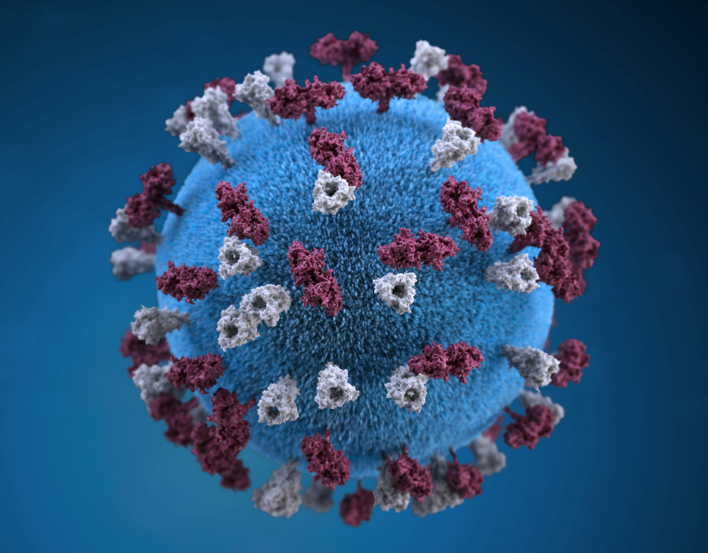
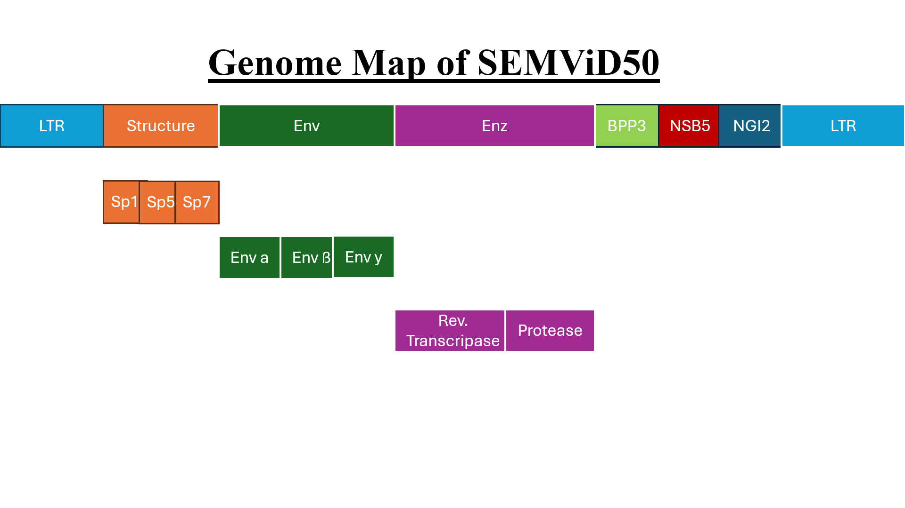

## General Information

SEMViD (short for Severe-Encephalitis-Marmot-Viral-Disease) is a [retrovirus](https://en.wikipedia.org/wiki/Retroviridae) which is responsible for the SEMViD disease and the corresponding SEMViD-50 pandemic in the years 2050 and 2051. When SEMViD was first discovered, its [phylogenetic](https://en.wikipedia.org/wiki/Phylogenetics) position was unknown, with no clear relatives being previously discovered.

## Taxonomy

<figure data-align="right" style="--figure-width: 220px">

</figure>

<table>
<tbody>
<tr>
<td>Realm:</td>
<td><a href="https://en.wikipedia.org/wiki/Riboviria">Riboviria</a></td>
</tr>
<tr>
<td>Kingdom:</td>
<td><a href="https://en.wikipedia.org/wiki/Pararnavirae">Pararnavirae</a></td>
</tr>
<tr>
<td>Phylum:</td>
<td><a href="https://en.wikipedia.org/wiki/Artverviricota">Artverviricota</a></td>
</tr>
<tr>
<td>Class:</td>
<td><a href="https://en.wikipedia.org/wiki/Revtraviricetes">Revtraviricetes</a></td>
</tr>
<tr>
<td>Order:</td>
<td><a href="https://en.wikipedia.org/wiki/Ortervirales">Ortervirales</a></td>
</tr>
<tr>
<td>Family:</td>
<td><a href="https://en.wikipedia.org/wiki/Retroviridae">Retroviridae</a></td>
</tr>
<tr>
<td>Subfamily:</td>
<td>Semvirinae</td>
</tr>
<tr>
<td>Genus:</td>
<td>Semvirus</td>
</tr>
</tbody>
</table>

While the positioning of SEMViD in the family of [Retroviridae](https://en.wikipedia.org/wiki/Retroviridae) was quite evident by its possession of [reverse transcriptase](https://en.wikipedia.org/wiki/Reverse_transcriptase), no other related viruses were known to science, so it needed to be assigned to the newly created subfamily of Semvirinae.

## Structure of genome

As a retrovirus, SEMViD has a [+ssRNA](https://en.wikipedia.org/wiki/Positive-sense_single-stranded_RNA_virus) genome, which is moderately prone to [mutations](https://en.wikipedia.org/wiki/Mutation). Its genome includes 10432 bases, most of which encode proteins. Those encoded proteins include viral envelope proteins that bear some resemblance to other retroviruses, surface proteins and viral enzymes such as the [RNA dependent DNA polymerase](https://en.wikipedia.org/wiki/RNA-dependent_RNA_polymerase) ([reverse transcriptase](https://en.wikipedia.org/wiki/Reverse_transcriptase)). AI aided structural analysis by the research group of virology expert Prof. Andy Gene revealed the functions of all viral proteins shortly after the sequence became available. Among the surface proteins, NSB5 (Neuronal Surface Binding Protein 5) and BPP3 (BarrierPenetrationProtein3) play central roles in [pathophysiology](https://en.wikipedia.org/wiki/Pathophysiology), with NSB5 allowing SEMViD to infect [neurons](https://en.wikipedia.org/wiki/Neuron), leading to its [encephalitic](https://en.wikipedia.org/wiki/Encephalitis) potential. BPP3 allows SEMViD to cross the [blood-brain barrier](https://en.wikipedia.org/wiki/Blood%E2%80%93brain_barrier), enabling an infection of the brain, even when the virus enters the host via its blood. Both of these proteins are targets to the vaccination, which was adapted in December 2050.

<figure style="--figure-width: 400px">

</figure>

## Transmission routes

### Alpha variant

The first variant of SEMViD could be transmitted via [ticks](https://en.wikipedia.org/wiki/Tick) as a [vector](https://en.wikipedia.org/wiki/Vector_%28epidemiology%29), with blood being the virus’s sole infectious bodily fluid. However, because of the possibility of infected blood getting into a healthy persons blood circle via transfusions, the Alpha variant of the disease could also get transmitted along this path. Several deathly cases of the SEMViD had their origin in blood being transfused, which led to one of the biggest blood supply shortages in history. The Alpha variant of SEMViD led to particularly severe cases and many deaths, which drastically reduced the contact rate of infected individuals due to their bedridden state.

### Beta variant

Following a mutation, the virus was no longer able to reproduce only in ticks; it could also reproduce in [mosquitoes](https://en.wikipedia.org/wiki/Mosquito), which thus became a second vector. Recent research suggests that a continuous infection in an unknown secondary host might have been a driver of this mutation. However, the Beta variant’s [incubation period](https://en.wikipedia.org/wiki/Incubation_period) is prolonged, which increased the [effective reproduction number](https://en.wikipedia.org/wiki/Basic_reproduction_number) through longer and undetected [viral shedding](https://en.wikipedia.org/wiki/Viral_shedding). This led to a higher number of infections but simultaneously to a reduced [mortality](https://en.wikipedia.org/wiki/Case_fatality_rate) among those being affected.

### Gamma variant

Strong measures against vector-borne transmission subjected the Beta variant to [selective pressure](https://en.wikipedia.org/wiki/Selective_pressure). It mutated again and was then able to spread from person to person through [mucosal contact](https://en.wikipedia.org/wiki/Mucous_membrane) as a second route of transmission. The Gamma variant was defined as a mutation with a reduced severity of symptoms but at the same time easily to get infected by.

#### Mutation Rate

In the alpha variant the initial [mutation rate](https://en.wikipedia.org/wiki/Mutation_rate) was intermediate at a rate of 7\*10^-6 mutations per base per cycle. However, continuous infection of some secondary hosts seems to have driven mutation in this variant. The mutation rate of the beta and gamma variants stayed quite consistent at 8\*10^-6 mutations per base per cycle. However, due to faster reproduction in mosquitoes, its effective mutation rate is increased. It is also of note that [selection](https://en.wikipedia.org/wiki/Natural_selection) renders quite a few mutants incapable of reproduction, as some of its genes need high specificity to infect host tissue. This effect makes those genes quite [conserved](https://en.wikipedia.org/wiki/Conserved_sequence).

## Tropism

SEMViD primarily infects [neurons](https://en.wikipedia.org/wiki/Neuron) in the brain, as those provide the necessary surface interactions that allow the virus to be internalized. This specific infection of neurons also leads to its encephalitic potential. It can also infect [neutrophilic granulocytes](https://en.wikipedia.org/wiki/Neutrophil) via its NGI2 (neutrophilic granulocyte infecting) protein. However, as its specificity is quite low, it infects only few cells, which it uses for reproduction. In its vectors, SEMViD primarily infects cells of the [salivary glands](https://en.wikipedia.org/wiki/Salivary_gland), where it reproduces without harm to the vectors. As a result, it can be transmitted by saliva of the tick or mosquito.
