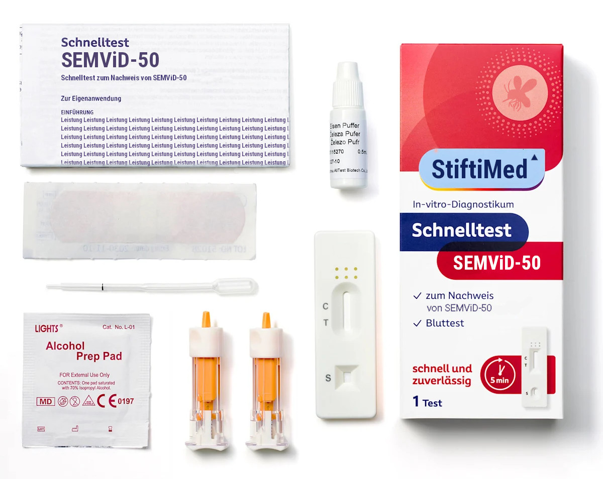

## PCR Tests

The most common form of tests used to identify SEMViD were PCR Tests. First versions were developed by the Robert Koch Institut and available by 21 July 2050, shortly after sequencing of the first genome. By 23 July 2050, a research group at ETH Zurich was able to improve upon the initial methodology to create more sensitive and cost-effective test.

PCR Tests were mainly used in lab and medical settings to identify the virus based on a small blood sample. Various governments also utilized them to certify individuals as free of SEMViD as they were highly reliabe with a sensitivity of over 99.5%.

## At-Home Tests

<figure data-align="right" style="--figure-width: 400px">

<figcaption>Content of an at-home test sold by StiftiMed.</figcaption>

</figure>

By August 2, a at-home test became available, whose development was headed by the Institut Pasteur. It quickly became the go-to method of testing of the wider affected population. Nonetheless, its sensitivity proved to be slightly lower than that of a PCR test at about 95%. It requires users to prick their finger and mix a few drops of their blood with a provided solution. A sample of this mixture is then poured into a test cassette which indicates the presence of SEMViD in the blood.

## Oral Tests

As the gamma variant of SEMViD gained prominence, a research group at EPFL developed an alternative to blood tests. It relied on an oral swab from patients, utilizing the fact that the variant had adapted to spread through mucosal contact. Despite its fast development, becoming available by 11th October 2050, it never saw wide adoption due to its lower sensitivity at \>91%.
