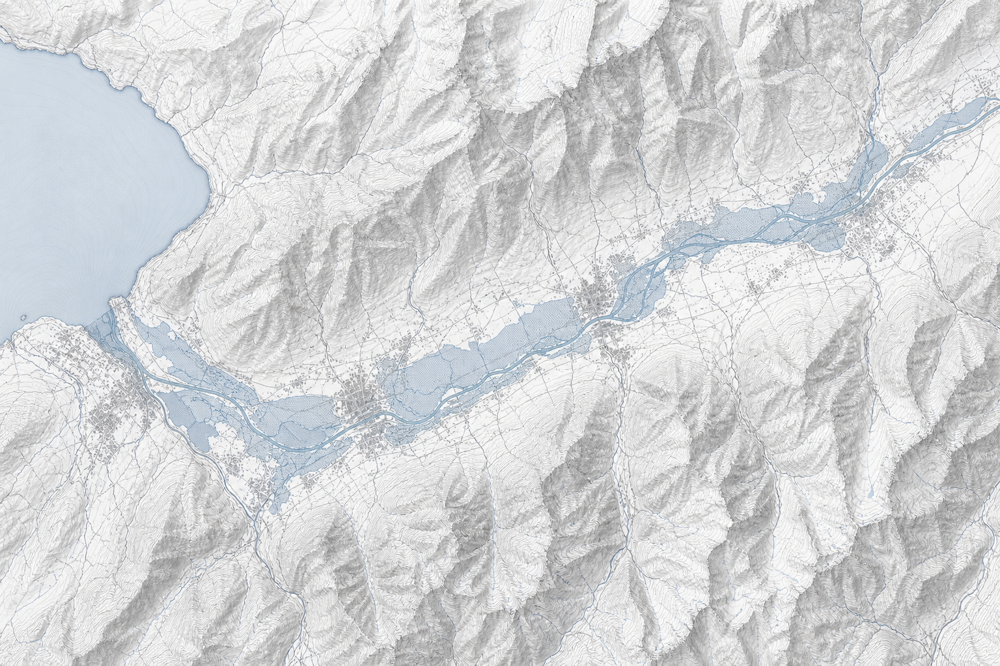

## Context

In November 2050 the [IPCC](https://en.wikipedia.org/wiki/Intergovernmental_Panel_on_Climate_Change) report highlighted important factors increasing danger for pandemics, especially the [SEMViD-50 pandemic](semvid_50_pandemic).

## Record Temperatures

2050 is again the warmest year since the start of weather reports. The winter especially in Central Europe is the mildest ever registered. [Global warming](https://en.wikipedia.org/wiki/Global_warming) is at an all-time high. The temperature on land has increased since [industrialisation](https://en.wikipedia.org/wiki/Industrial_Revolution) about 2.2 degrees. The [1.5-degree-target](https://en.wikipedia.org/wiki/1.5-degree_target) is history and we are looking towards a future with about 2.5 degrees global warming.

## Melting of Permafrost

With increasing tempartures more [permafrost](https://en.wikipedia.org/wiki/Permafrost) regions like [Sibiria](https://en.wikipedia.org/wiki/Siberia) and [Greenland](https://en.wikipedia.org/wiki/Greenland) loose their permafrost. In [Switzerland](https://en.wikipedia.org/wiki/Switzerland) the [glaciers](https://en.wikipedia.org/wiki/Glacier) are also melting faster than ever. This increases the possibility for dangers with unknown [viruses](https://en.wikipedia.org/wiki/Virus). Origin of SEMViD: Since 1980, the thawing of Swiss permafrost has rapidly accelerated. The effects of this climate-change-induced process are widely acknowledged as detrimental to local infrastructure, communities, and tourism. In recent months, growing evidence points to the origin of the SEMViD pathogen originating in this melting permafrost.

Another consequence is the [rise of sea levels](https://en.wikipedia.org/wiki/Sea_level_rise).

## Extreme Weather Events

[Extreme weather events](https://en.wikipedia.org/wiki/Extreme_weather) are evolving and the frequency and consequences are growing all over the world. [Wild Fires](https://en.wikipedia.org/wiki/Wildfire) are raging all over the equatorial climate zones and more and more people need to flee their home-countries in order to stay in a habitable environment. Also the [Flood Catastrophes](https://en.wikipedia.org/wiki/Flood) have increased. In 2050 was the year with the most flood ever. For example the Flood Catastrophe Rhone-valley was one of the most costly floods in recent history.

### Flood Catastrophe Rhone-valley 2050

<figure data-align="right" style="--figure-width: 400px">

</figure>

In June and July, heavy rainfall throughout the Western Alps region caused catastrophic flooding, which reached its peak in the Swiss Rhône Valley. This sudden heavy rainfall quickly overwhelmed the local disaster response forces. Although many such extreme weather events, which had become significantly more frequent worldwide in recent years, had already been successfully managed globally, such as the severe El Niño year of 2049, and people were consequently aware of the risks posed by major environmental disasters, no such severe events were expected on the mainland, particularly in the mountains. As a result, the authorities were severely overwhelmed due to a lack of appropriate expertise and preparedness. Estimates put the death toll at around 1,200, while approximately 20,000 people urgently required medical assistance.

Immediately after the outbreak of the SEMViD disease, the medical infrastructure in the surrounding areas was on the verge of collapse and could only be prevented from completely collapsing through humanitarian and financial assistance from neighboring countries. As soon as the first SEMViD infections were detected, a large-scale evacuation of injured people to France was ordered in order to alleviate the strained situation.

## Climate Refugees

With the rise of sea-levels and more inhuman conditions in certain areas the increase of [refugees](https://en.wikipedia.org/wiki/Climate_refugee) challenges local governments. We advise to take this development seriously and dedicate funds to provide healthy and clean environments for refugees.
